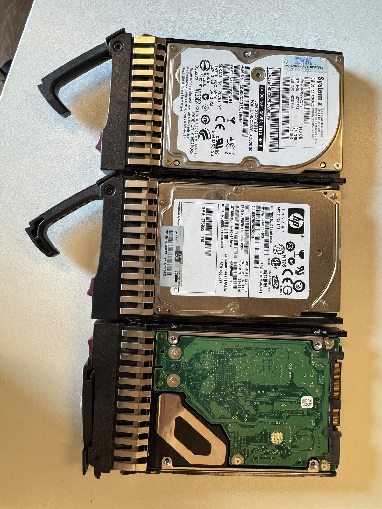
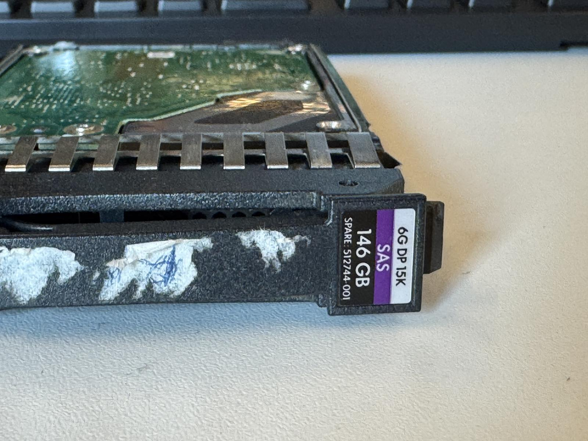
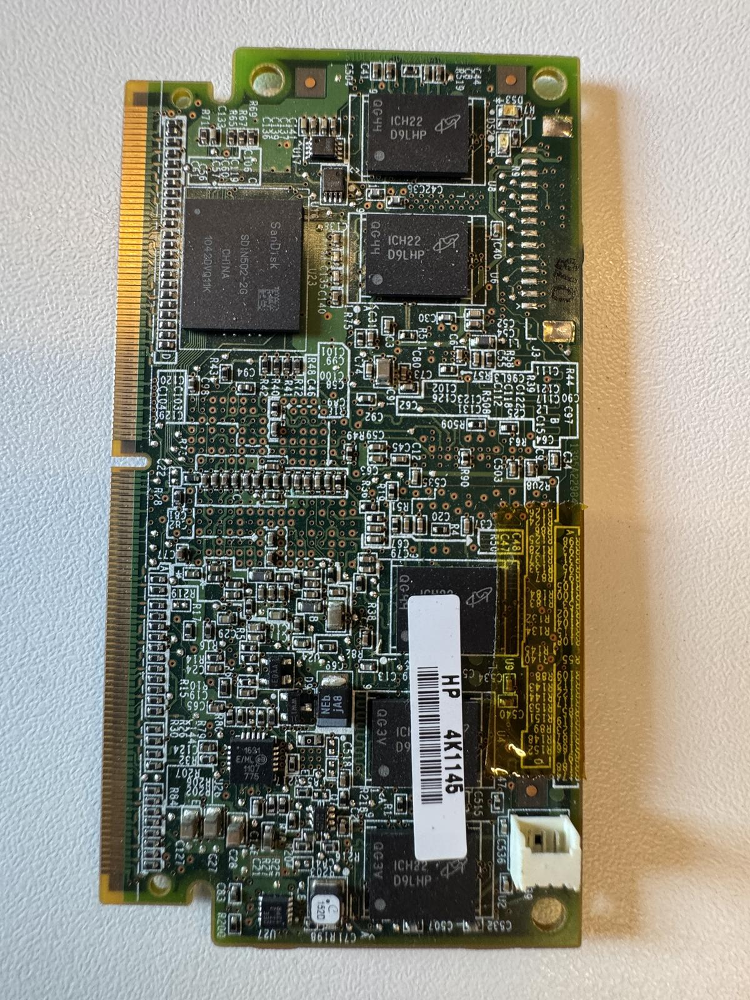
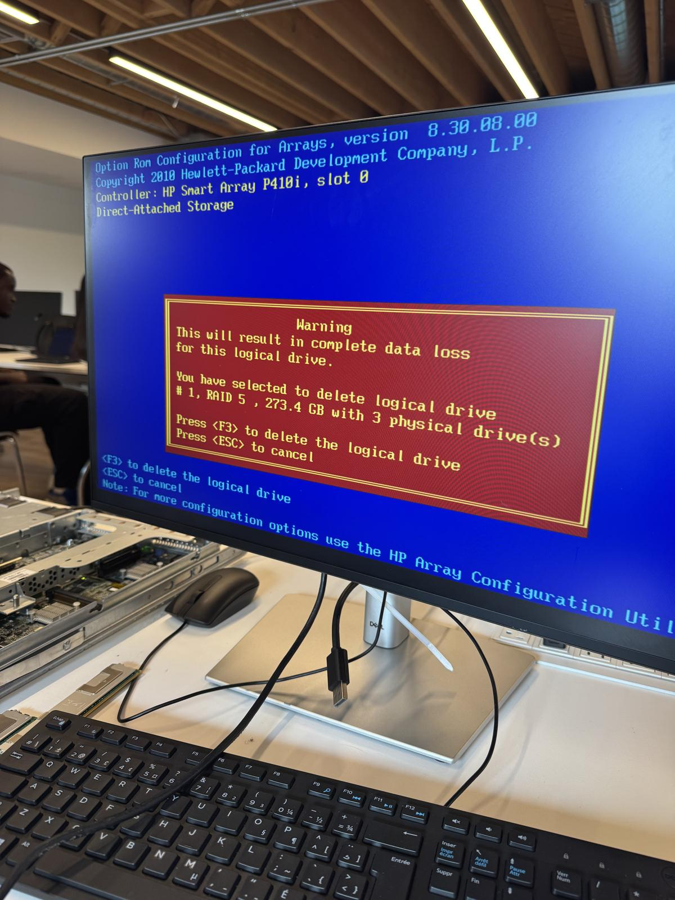
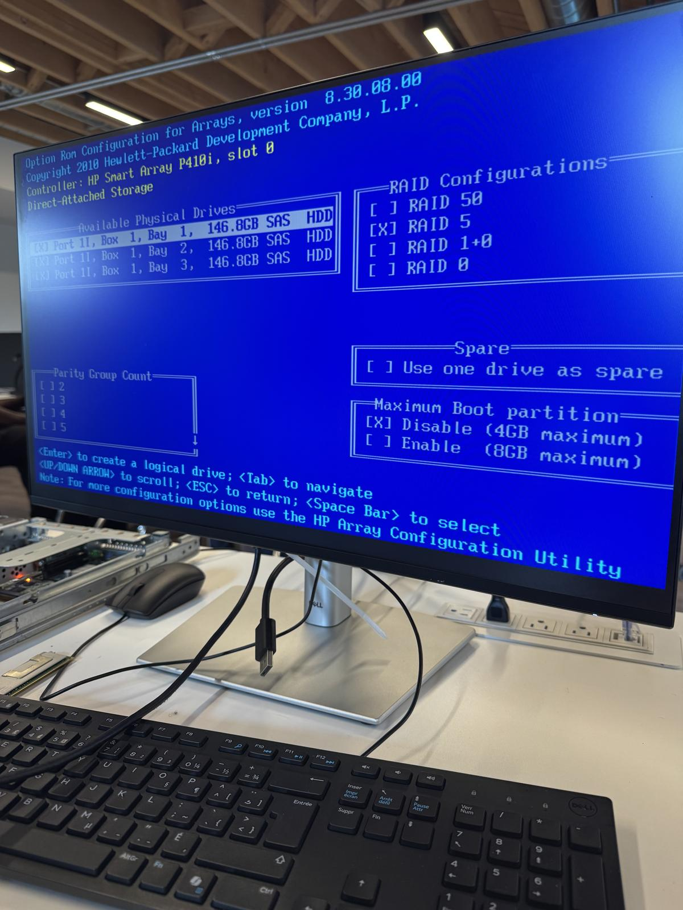
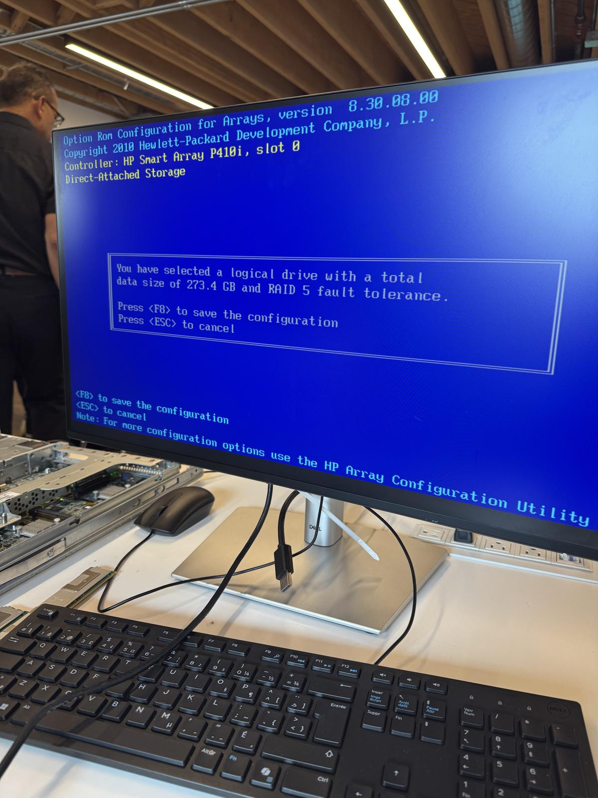
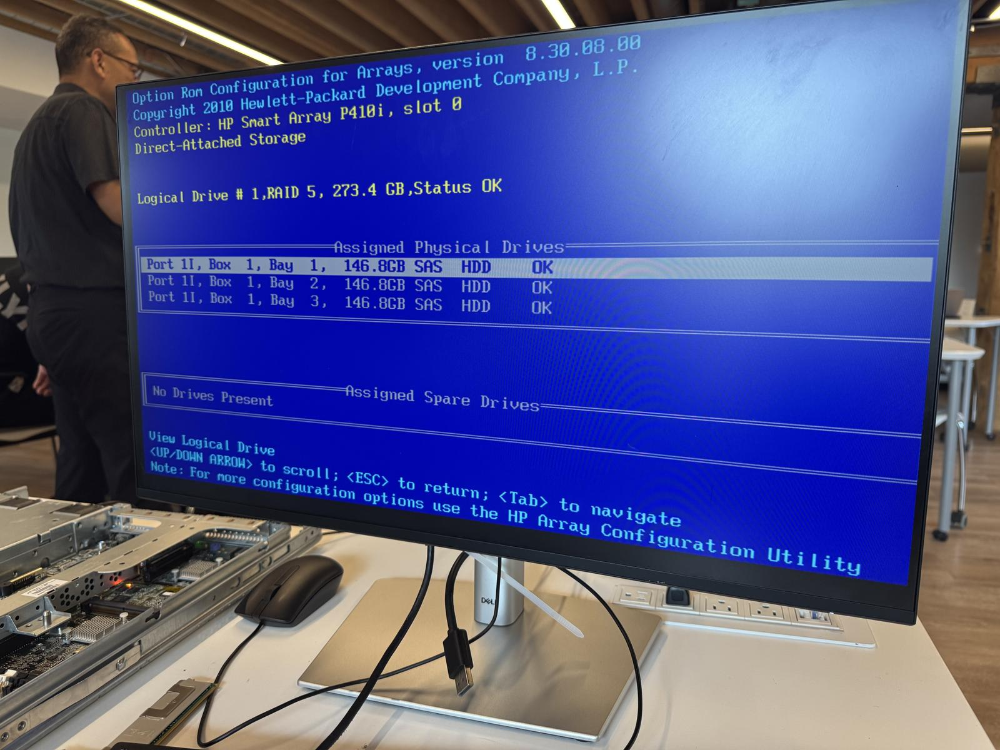
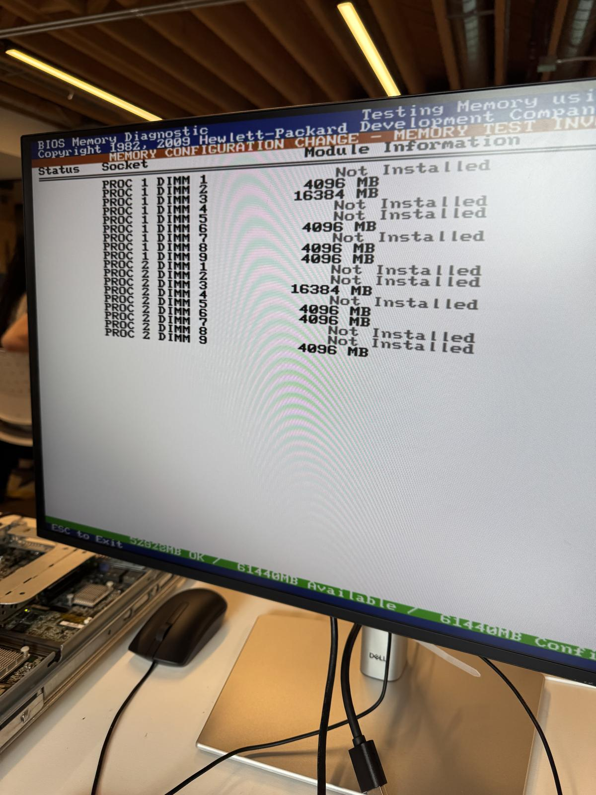
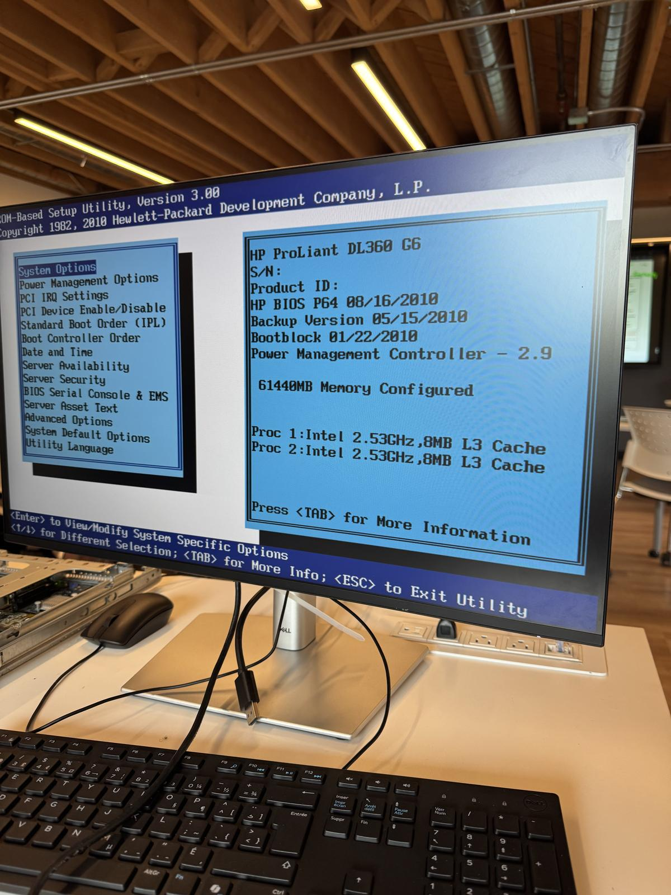

Ouassim Ahmed Benamira
Matricule : 300150564 Programme : TSIQ - Techniques des systèmes informatiques

Lab — Démontage et remontage d'un serveur
Matériel identifié
3 disques durs SAS (146 Go)
2 blocs d'alimentation
2 RAM 16 Go + 8 RAM 4 Go
2 CPU Intel 2.53 GHz
Étape 1 — Retrait des blocs d'alimentation

 Retrait des 2 blocs d'alimentation HP.

 Retrait des 3 disques durs SAS hot-swap.

 Étiquette d'un disque : SAS 15K, 146 Go.

Étape 2 — Retrait des barrettes RAM

 Barrettes RAM PC3-8500R : 1x16 Go + 4x4 Go visibles.

Étape 3 — Retrait du CPU

 Retrait d'un CPU Intel Xeon 2.53 GHz.

Étape 4 — Module de mémoire cache

 Module cache du contrôleur RAID (HP 4K1145).

Étape 5 — 1er démarrage : 1 RAM 16 Go + 1 CPU

 BIOS : 16 GB Installed, 1 Processor detected (Xeon E5540 @ 2.53GHz).

 Écran de boot, appui sur F9.

 ROM-Based Setup Utility : HP ProLiant DL360 G6, Proc 2 Not Installed.

Étape 6 — 2ème démarrage : 1 RAM 16 Go + 2 CPU

 16384MB Memory Configured, Proc 1 et Proc 2 détectés.

Étape 7 — Formatage des disques (HP Array Configuration Utility)

 Menu principal : Create/View/Delete Logical Drive.

 Suppression de l'ancien Logical Drive (RAID 5, 273.4 GB).

 Sélection des 3 disques + RAID 5.

 Résumé config, F8 pour sauvegarder.

 Logical Drive #1, RAID 5, 273.4 GB, Status OK.

Étape 8 — Installation de tous les composants

 BIOS Memory Diagnostic : 61440MB Available (toutes les RAM).

 Config finale : 60 Go RAM, 2 CPU détectés.
