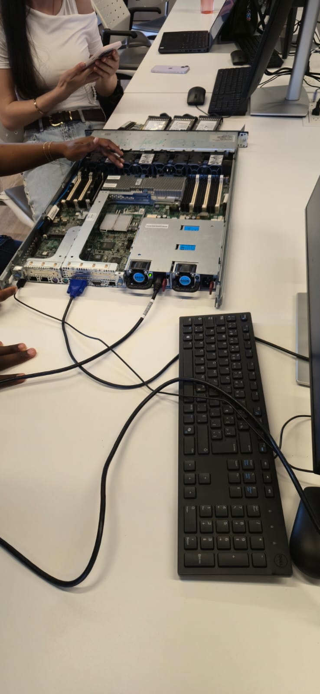
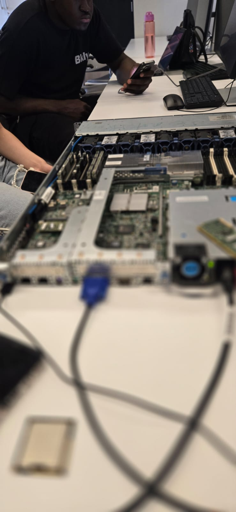
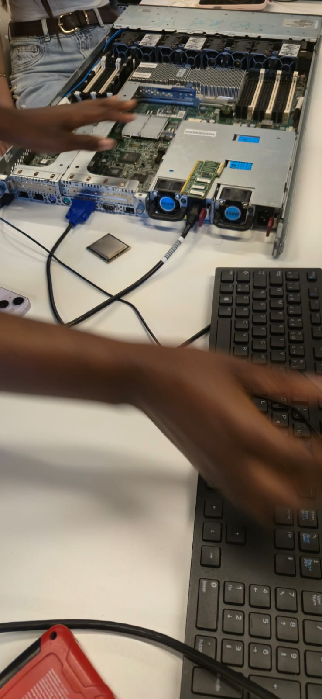
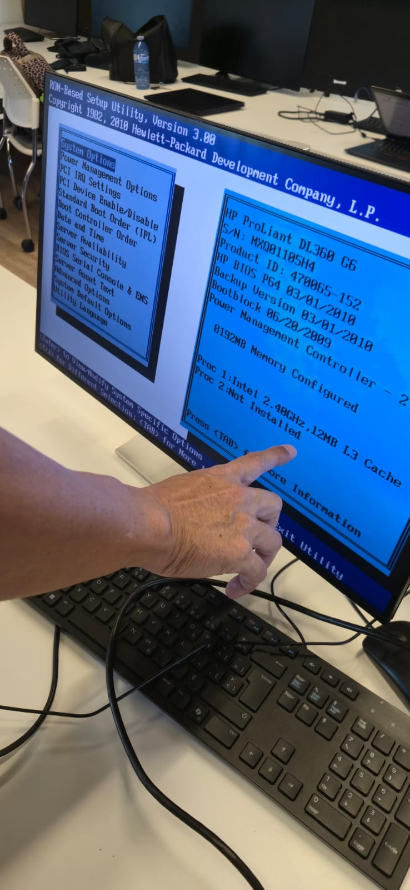
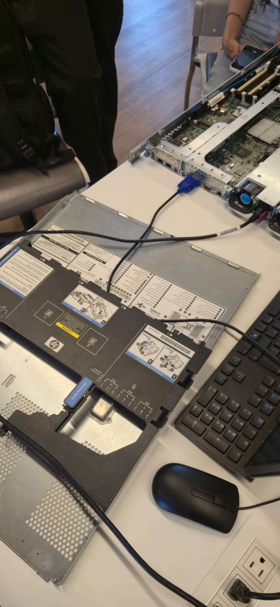
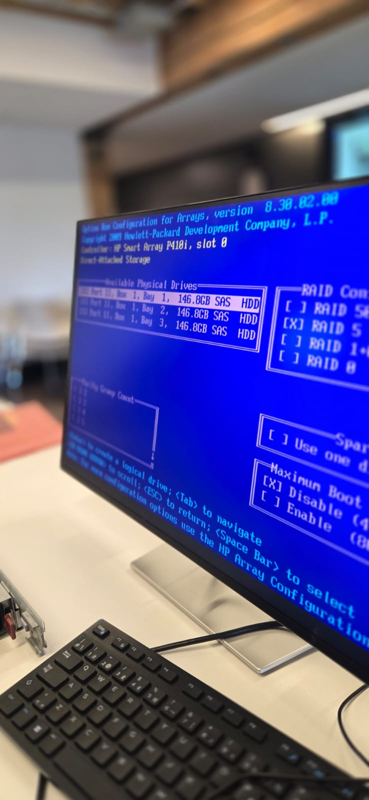
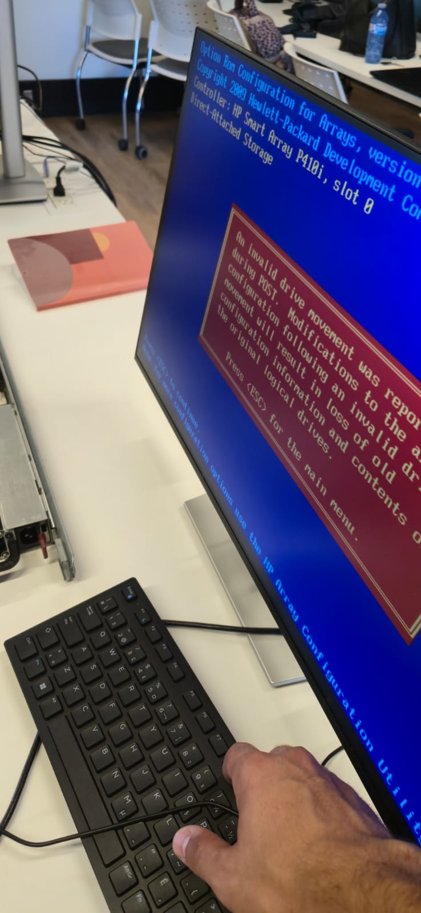
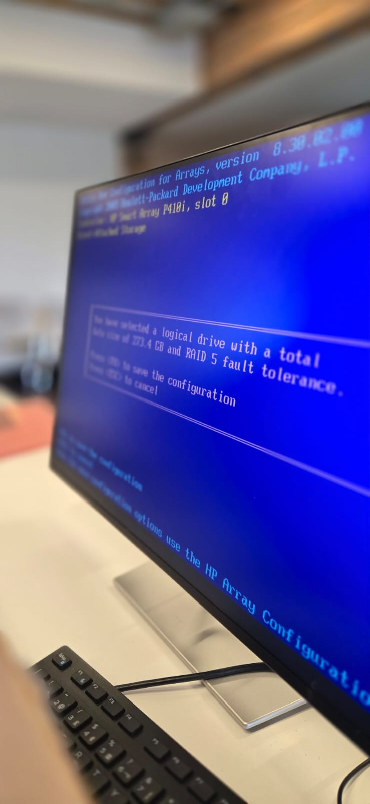

# 300151315

# 🖥️ Server Setup — HP ProLiant DL360 G6

Documentation of the hardware build and RAID configuration for an **HP ProLiant DL360 G6** server.

## 📑 Table of Contents

- [System Information](#ℹ️-system-information)
- [1. Build Overview](#1-build-overview)
- [2. RAM Installation](#2-ram-installation)
- [3. CPU Installation](#3-cpu-installation)
- [4. Hard Drive Installation](#4-hard-drive-installation)
- [5. Boot Sequence (POST)](#5-boot-sequence-post)
- [6. RAID Configuration](#6-raid-configuration-hp-smart-array-utility)
- [Final Configuration Summary](#-final-configuration-summary)
- [Notes](#️-notes)

## ℹ️ System Information

| Field | Value |
|---|---|
| Model | HP ProLiant DL360 G6 |
| Serial Number (S/N) | `MXQ01105H4` |
| Product ID | `470065-152` |
| BIOS Version | P64, 03/01/2010 |
| RAID Controller | HP Smart Array P410i, slot 0 |

---

## 1. Build Overview

The server was opened on the workbench to install and verify its internal components (RAM, CPU, drives) before being remounted in the rack.

  

<em>Figure 1 — Server open on the bench, monitor, keyboard and mouse connected directly for configuration.</em>

 

## 2. RAM Installation

The installed memory consists of **4 x 16 GB sticks**, for a total of **64 GB of RAM**, inserted into the DIMM slots on the motherboard.

  

<em>Figure 2 — Installing the RAM sticks on the motherboard.</em>

 

## 3. CPU Installation

The server has two CPU sockets (Proc 1 and Proc 2). Only one processor could be installed and configured successfully.

- ✅ **Proc 1**: installed and working (Intel, 2.40 GHz, 12 MB L3 cache)
- ❌ **Proc 2**: an installation attempt was made, but it was not recognized by the system (`Not Installed`) — not used in the final configuration

  

<em>Figure 3 — Attempt to install the second processor (open socket, CPU set aside).</em>

 

  

<em>Figure 4 — ROM-Based Setup Utility (RBSU) confirming CPU status: Proc 2 = `Not Installed`.</em>

 

## 4. Hard Drive Installation

Three SAS hard drives of **146.8 GB** each were installed in the server's drive bays (Bay 1, Bay 2, and Bay 3, Port 1I, Box 1).

  

<em>Figure 5 — Server chassis open, showing the drive bay slots.</em>

 

## 5. Boot Sequence (POST)

On boot, the server runs its POST (Power-On Self-Test) sequence: initializing the SATA controller, the Broadcom NetXtreme II network card, the iLO 2 (Integrated Lights-Out) module, and then the **Smart Array P410i** controller.

  

<em>Figure 6 — POST screen: initializing the Smart Array P410i controller before entering the configuration utility.</em>

 

This is the point where you need to press `F8` to enter the RAID configuration utility (see next section).

## 6. RAID Configuration (HP Smart Array utility)

RAID configuration was done at server boot using the following key:

> 🔑 **Key used: `F8`** — opens the controller configuration utility ("Option ROM Configuration for Arrays") to format and configure the drives.

### 6.1 Drive Selection and RAID Level

The three available physical drives (146.8 GB SAS HDD each) are detected by the HP Smart Array P410i controller. **RAID 5** was selected, providing fault tolerance with parity striped across the drives.

  

<em>Figure 7 — Selecting the physical drives and RAID 5.</em>

 

### 6.2 ⚠️ Issue Encountered: Invalid Drive Movement

During a reconfiguration, the utility reported the following error:

> **An invalid drive movement was reported during POST.**
> Modifications to the array configuration following an invalid drive movement will result in loss of old configuration information and contents of the original logical drives.
> Press `<ESC>` for the main menu.

  

<em>Figure 8 — Controller error following a physical drive being moved/swapped between two boots.</em>

 

**Likely cause:** a drive was unplugged, reinserted into a different bay, or the drive order changed between two boots, preventing the controller from matching the original RAID configuration.

**Resolution:** press `ESC` to return to the main menu, confirm each drive is back in its original bay (Bay 1, 2, 3), then recreate or confirm the RAID 5 configuration as needed.

### 6.3 Saving the Configuration

Once RAID 5 is selected (and confirmed without error), the system displays a summary of the logical drive created — total size of **273.4 GB** with RAID 5 fault tolerance — before asking for confirmation.

  

<em>Figure 9 — Confirming the configuration (Enter to save, Esc to cancel).</em>

 

- `Enter` (RETURN) → save the configuration
- `Esc` (ESC) → cancel

---

## 📋 Final Configuration Summary

| Component | Detail |
|---|---|
| RAM | 64 GB (4 x 16 GB) |
| CPU(s) | 1 x Intel (2.40 GHz, 12 MB L3) — Proc 2 not working |
| Hard drives | 3 x 146.8 GB SAS HDD |
| RAID configuration | RAID 5 — 273.4 GB logical drive |
| RAID setup method | `F8` key at boot → HP Array Configuration Utility |

## ⚠️ Notes

- The second processor (Proc 2) was tested but not recognized by the system; only one processor remains installed in the current configuration.
- Drive formatting and configuration is done exclusively through the utility accessible via `F8` at server boot, before the operating system loads.
- Moving a drive between two boots triggered an "invalid drive movement" error — always put each drive back in its original bay to avoid losing the existing RAID configuration.

