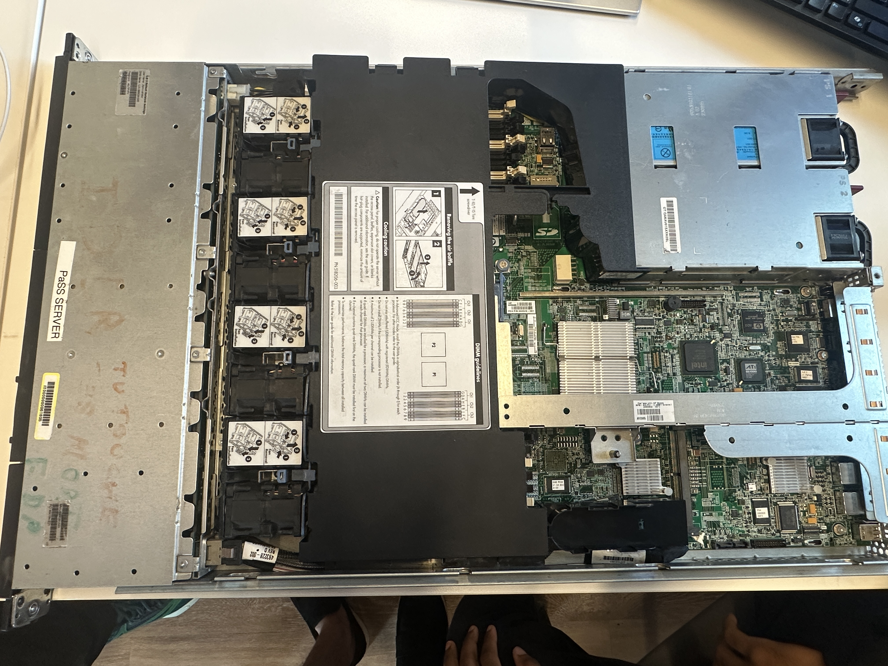
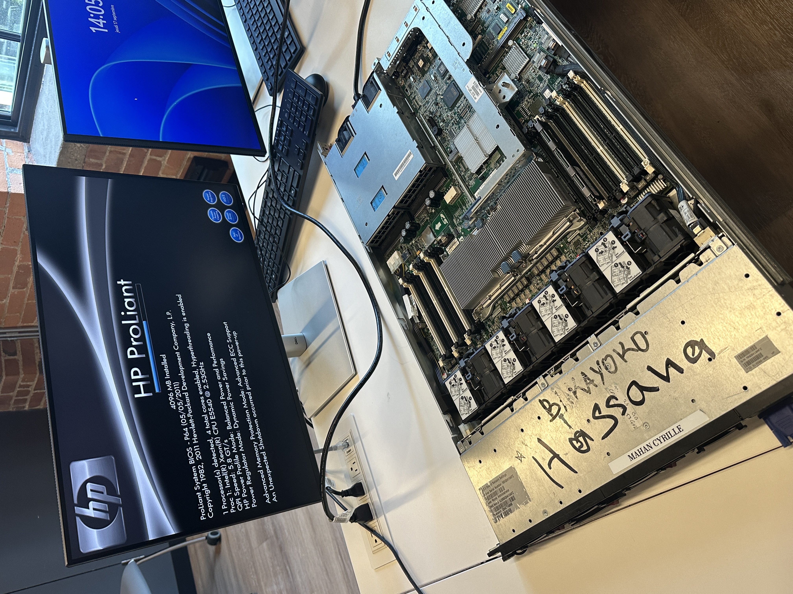
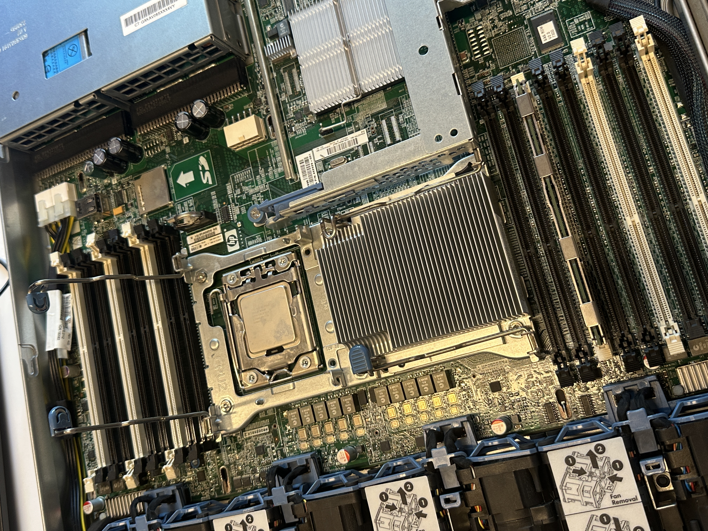
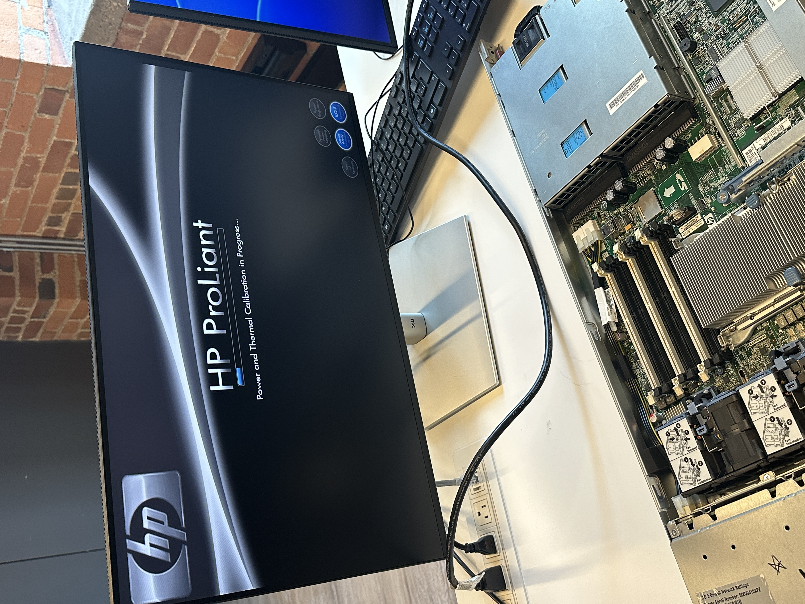
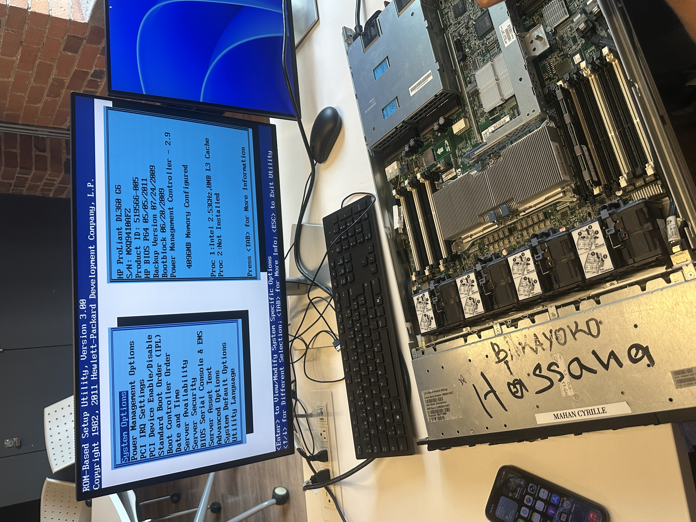
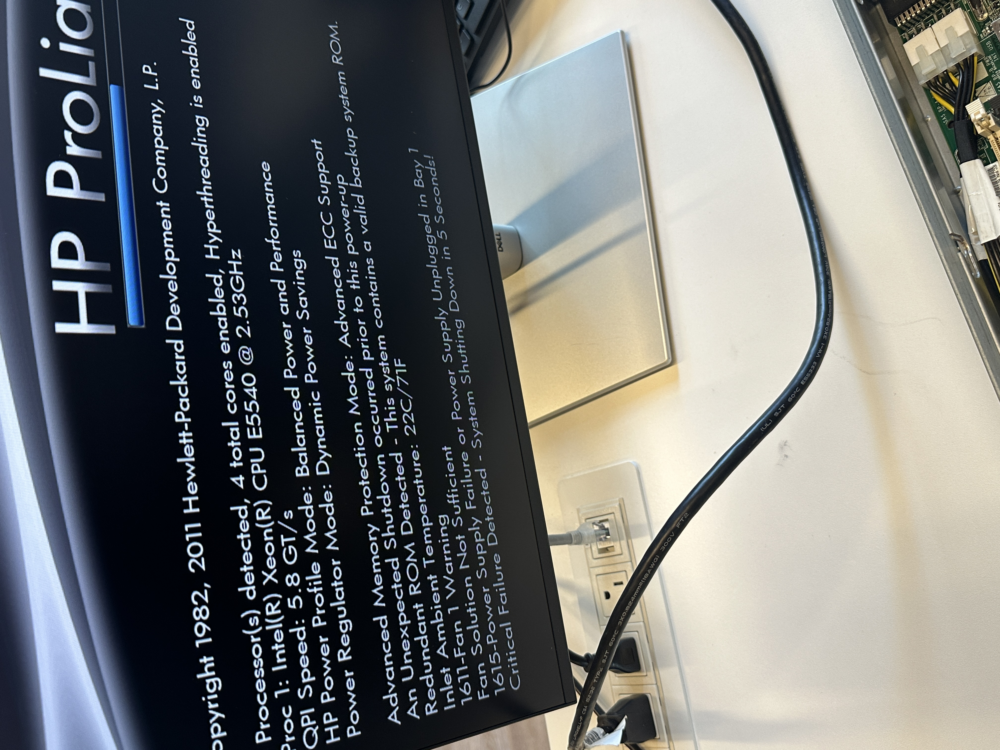

# 300156187
# 🖥️ Démontage du serveur — HP ProLiant DL360 G6

Documentation de l'assemblage matériel et de la configuration RAID pour un serveur HP ProLiant DL360 G6.

## 📑 Table des matières
- [Informations système](#-informations-système)
- [1. Aperçu de l'assemblage](#1-aperçu-de-lassemblage)
- [2. Installation de la RAM](#2-installation-de-la-ram)
- [3. Installation du processeur (CPU)](#3-installation-du-processeur-cpu)
- [5. Séquence de démarrage (POST)](#5-séquence-de-démarrage-post)
- [6. Configuration RAID](#6-configuration-raid-utilitaire-hp-smart-array)
- [Résumé de la configuration finale](#-résumé-de-la-configuration-finale)
- [Notes](#️-notes)

---

## ℹ️ Informations système

| Champ | Valeur |
| :--- | :--- |
| **Modèle** | HP ProLiant DL360 G6 |
| **Numéro de série (S/N)** | MXQ9410AFZ |
| **ID Produit** | 519566-005 |
| **Version du BIOS** | P64, 05/05/2011 |

---

## 1. Aperçu de l'assemblage

Le serveur a été ouvert sur l'établi pour installer et vérifier ses composants internes (RAM, CPU, disques) avant d'être remonté dans le rack.

  
  
<em>Figure 1 — Serveur ouvert sur l'établi, moniteur, clavier et souris connectés directement pour la configuration.</em>

---

## 2. Installation de la RAM

La mémoire installée se compose de 4 barrettes de 16 Go, pour un total de 64 Go de RAM, insérées dans les emplacements DIMM de la carte mère.

  
  
<em>Figure 2 — Installation des barrettes de RAM sur la carte mère.</em>

---

## 3. Installation du processeur (CPU)

Le serveur dispose de deux sockets CPU (Proc 1 et Proc 2). Un seul processeur a pu être installé et configuré avec succès.
* ✅ **Proc 1 :** installé et opérationnel (Intel, 2.40 GHz, cache L3 de 12 Mo)
* ❌ **Proc 2 :** une tentative d'installation a été effectuée, mais il n'a pas été reconnu par le système (Non installé) — non utilisé dans la configuration finale.

  
  
<em>Figure 3 — Tentative d'installation du second processeur (socket ouvert, CPU mis de côté).</em>

---

## 4. Installation des disques durs

Trois disques durs SAS de 146,8 Go chacun ont été installés dans les baies de disques du serveur (Baie 1, Baie 2 et Baie 3, Port 1I, Boîtier 1).

  
  
<em>Figure 4 — Châssis du serveur ouvert, montrant les emplacements des baies de disques.</em>

---

## 5. Séquence de démarrage (POST)

Au démarrage, le serveur exécute sa séquence POST (Power-On Self-Test) : initialisation du contrôleur SATA, de la carte réseau Broadcom NetXtreme II, du module iLO 2 (Integrated Lights-Out), puis du contrôleur Smart Array P410i.

  
  
<em>Figure 5 — Écran POST : initialisation du contrôleur Smart Array P410i avant d'entrer dans l'utilitaire de configuration.</em>

C'est à ce moment précis qu'il faut appuyer sur **F8** pour accéder à l'utilitaire de configuration RAID (voir la section suivante).

---

## 6. Configuration RAID (Utilitaire HP Smart Array)

La configuration RAID a été effectuée au démarrage du serveur en utilisant la touche suivante :
* 🔑 **Touche utilisée :** **F8** — ouvre l'utilitaire de configuration du contrôleur (*Option ROM Configuration for Arrays*) pour formater et configurer les disques.

### 6.1 Sélection des disques et niveau RAID
Les trois disques physiques disponibles (146,8 Go SAS HDD chacun) sont détectés par le contrôleur HP Smart Array P410i. Le **RAID 5** a été sélectionné, offrant une tolérance aux pannes avec parité répartie sur les disques.

  
  
<em>Figure 6 — Sélection des disques physiques et du RAID 5.</em>

### 6.2 ⚠️ Problème rencontré : Ventilateur 1 démarre pas
Lors d'une reconfig, l'utilitaire a affiché l'erreur suivante :
> *1611-Fan 1 Warning
Fan Solution Not Sufficient
1615-Power Supply Failure or Power Supply Unplugged in Bay 1
Critical Failure Detected - System Shutting Down in 5 Seconds!.*

  
  
<em>Figure 7 — Erreur du ventilateur.</em>

* **Causes probables :** Ventilateur bloqué ou défectueux : pales bloquées, moteur HS, poussière importante. Ventilateur mal branché : connecteur partiellement débranché ou câble endommagé. Mauvais emplacement du ventilateur : sur certains serveurs, le ventilateur doit être installé dans un emplacement précis.. etc. 
* **Résolution :** Retrait, nettoyage et replacement du ventilateur 1.

### 6.3 Enregistrement de la configuration
Une fois le RAID 5 sélectionné (et validé sans erreur), le système affiche un résumé du lecteur logique créé — une taille totale de 273,4 Go avec la tolérance aux pannes RAID 5 — avant de demander confirmation.

  
  
<em>Figure 9 — Confirmation de la configuration (Entrée pour enregistrer, Échap pour annuler).</em>

* **Entrée (RETURN) :** enregistre la configuration
* **Échap (ESC) :** annule

---

## 📋 Résumé de la configuration finale

| Composant | Détail |
| :--- | :--- |
| **RAM** | 64 Go (4 x 16 Go) |
| **Processeur(s)** | 1 x Intel (2,53 GHz, cache L3 8Mb) — Proc 2 non fonctionnel |
| **Disques durs** | 3 x 146,8 Go SAS HDD |
| **Configuration RAID** | RAID 5 — Lecteur logique de 273,4 Go |
| **Méthode de configuration RAID** | Touche `F8` au démarrage → Utilitaire de configuration HP Array |

---

## ⚠️ Notes

* Le second processeur (Proc 2) a été testé mais n'a pas été reconnu par le système ; un seul processeur reste installé dans la configuration actuelle.
* Le formatage et la configuration des disques s'effectuent exclusivement via l'utilitaire accessible via `F8` au démarrage du serveur, avant le chargement du système d'exploitation.
* Le déplacement d'un disque entre deux démarrages a déclenché une erreur de « mouvement de disque invalide » — veillez toujours à remettre chaque disque dans sa baie d'origine pour éviter de perdre la configuration RAID existante.
