# 🖥️ Démontage et remontage d'un serveur HP ProLiant DL360 G6

**Étudiant :** Ouassim Ahmed Benamira  
**Matricule :** 300150564  
**Programme :** TSIQ – Techniques des systèmes informatiques

---

## 🎯 Objectif du laboratoire

L'objectif de ce laboratoire est de **démonter, identifier et remonter les principaux composants matériels d'un serveur HP ProLiant DL360 G6**.

Le laboratoire permet également de vérifier la détection des processeurs et de la mémoire dans le BIOS, puis de configurer les disques avec le contrôleur RAID du serveur.

---

## 🔍 Matériel identifié

Lors du démontage du serveur, les composants suivants ont été identifiés :

- 💽 **3 disques durs SAS de 146 Go**
- 🔌 **2 blocs d'alimentation HP**
- 🧠 **2 barrettes RAM de 16 Go**
- 🧠 **8 barrettes RAM de 4 Go**
- ⚙️ **2 processeurs Intel Xeon à 2,53 GHz**
- 💾 **Contrôleur RAID avec module de mémoire cache**

---

# 🔧 Partie 1 — Démontage du serveur

## 🔌 **Étape 1 — Retrait des blocs d'alimentation**

Les deux blocs d'alimentation du serveur HP sont retirés afin d'identifier les composants et de poursuivre le démontage en toute sécurité.

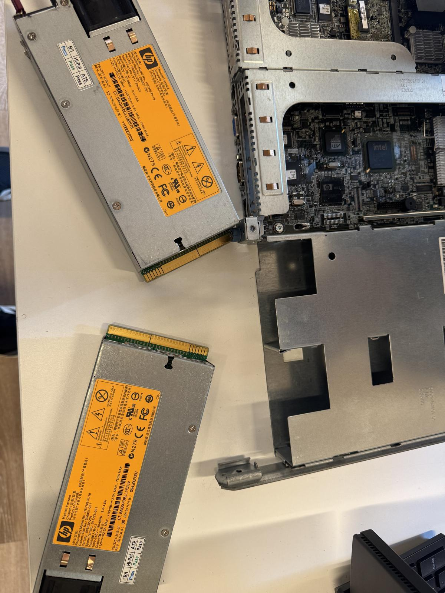

**Retrait des deux blocs d'alimentation HP.**

---

## 💽 **Étape 2 — Retrait des disques durs**

Les trois disques durs sont retirés des baies **hot-swap** situées à l'avant du serveur.

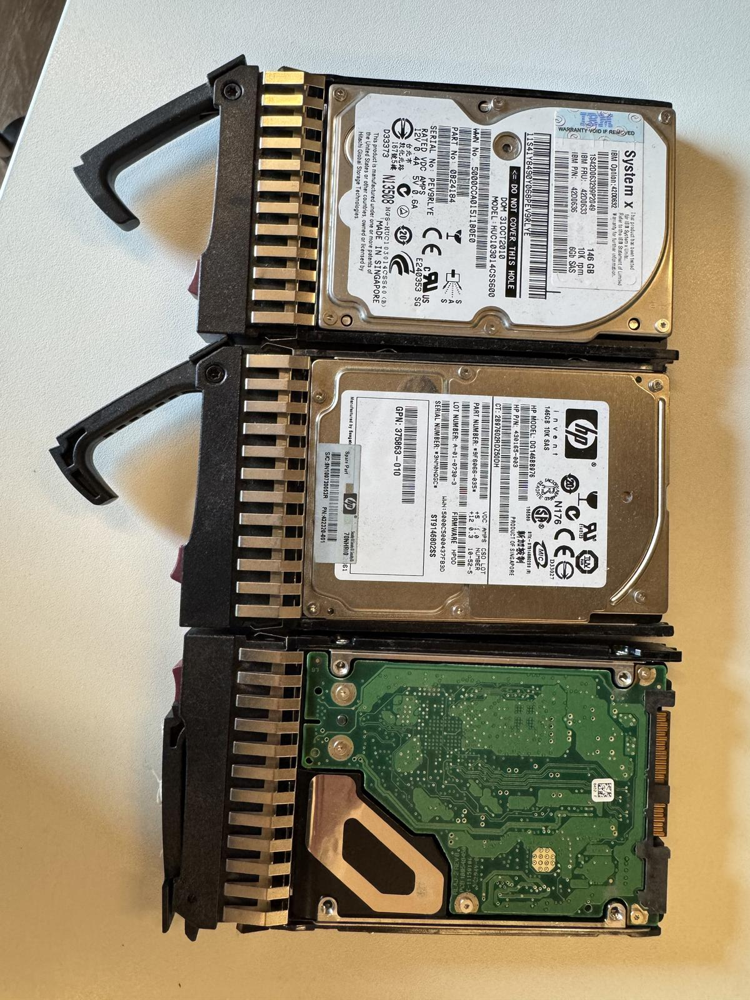

**Retrait des trois disques durs SAS hot-swap.**

Un des disques est ensuite examiné afin d'identifier ses caractéristiques.

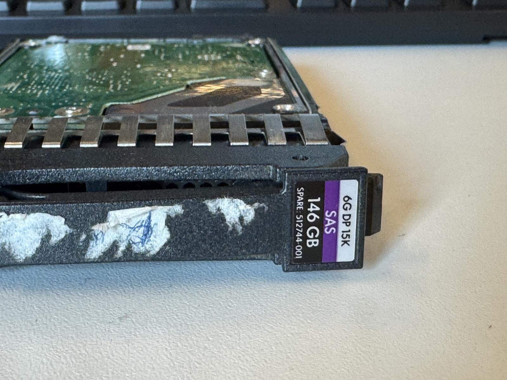

**Disque dur SAS 15K d'une capacité de 146 Go.**

---

## 🧠 **Étape 3 — Retrait des barrettes RAM**

Les barrettes de mémoire RAM sont retirées de leurs emplacements afin d'identifier leur type et leur capacité.

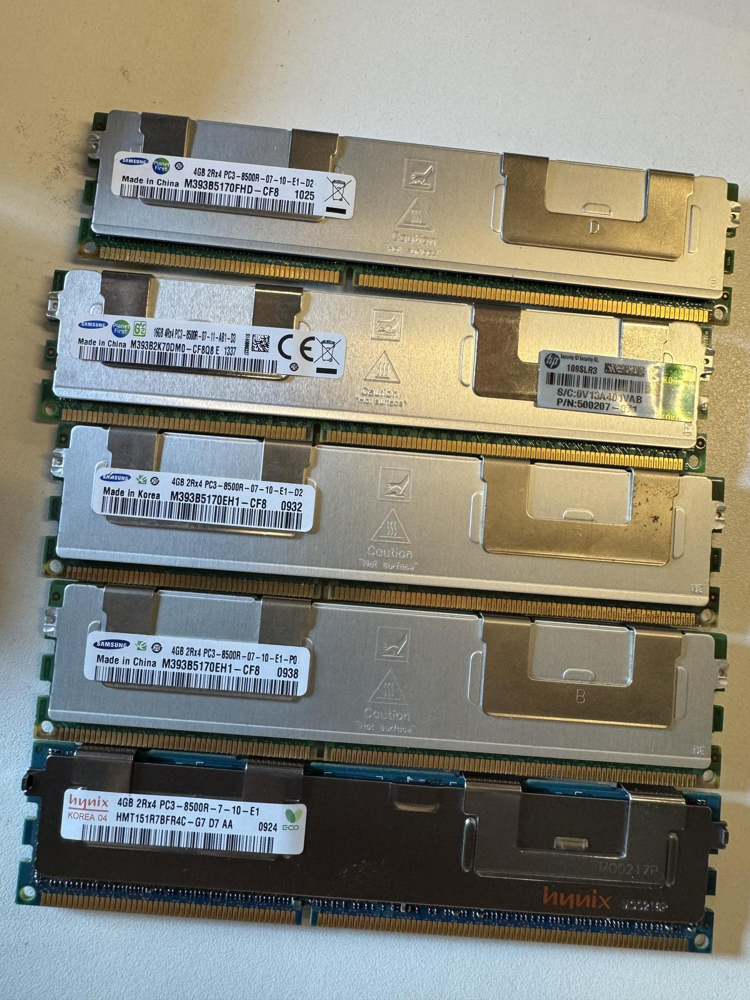

**Barrettes RAM PC3-8500R : une barrette de 16 Go et quatre barrettes de 4 Go visibles.**

---

## ⚙️ **Étape 4 — Retrait du processeur**

Après le retrait du système de refroidissement, un des processeurs est retiré de son socket.

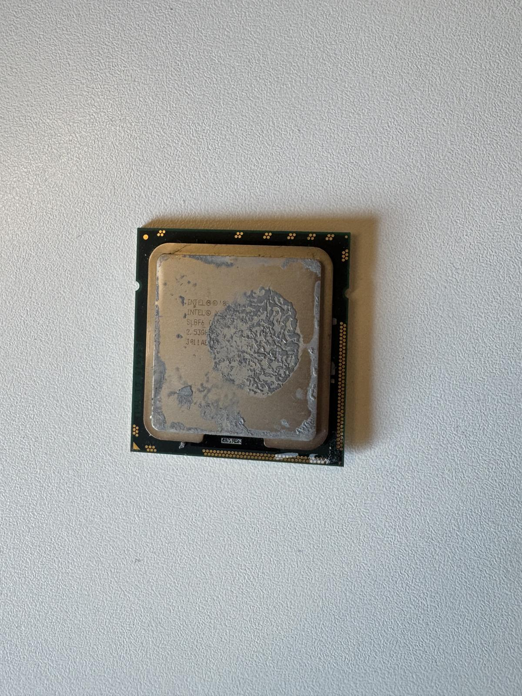

**Retrait d'un processeur Intel Xeon cadencé à 2,53 GHz.**

---

## 💾 **Étape 5 — Identification du module de mémoire cache**

Le serveur possède également un module de mémoire cache associé au contrôleur RAID.

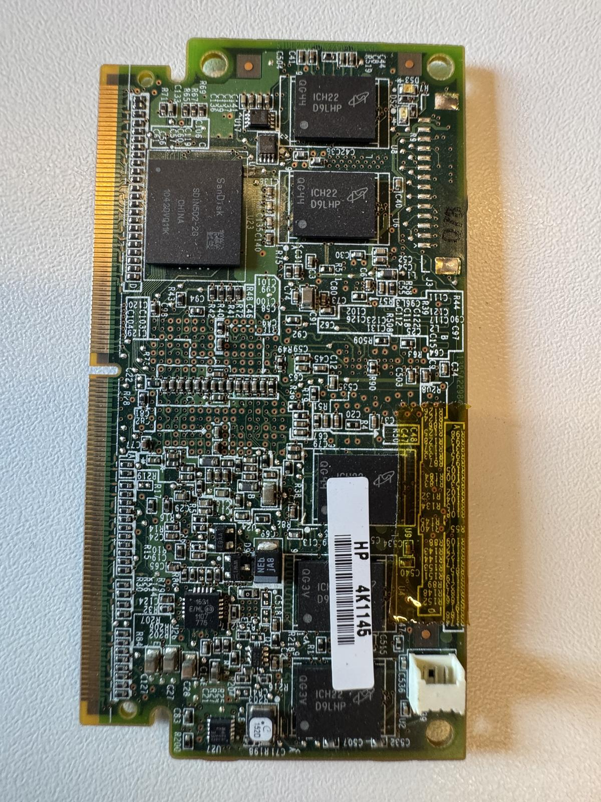

**Module de mémoire cache du contrôleur RAID HP.**

---

# 🧪 Partie 2 — Tests des composants

## 🟢 **Étape 6 — Premier démarrage avec 1 CPU et 16 Go de RAM**

Pour vérifier le fonctionnement du serveur avec une configuration minimale, un premier démarrage est effectué avec :

- **1 processeur**
- **1 barrette RAM de 16 Go**

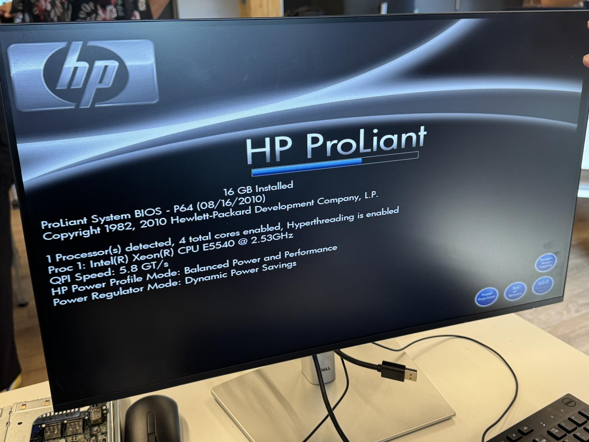

Le BIOS détecte :

- **16 GB Installed**
- **1 Processor**
- **Intel Xeon E5540 @ 2.53 GHz**

---

### ⚙️ **Accès au BIOS**

Pendant le démarrage, la touche **F9** permet d'accéder à l'utilitaire de configuration du serveur.

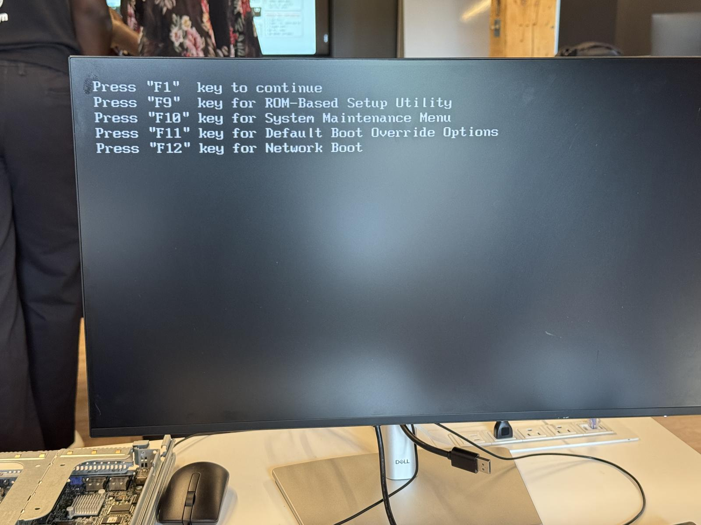

**Écran de démarrage du serveur et accès au BIOS avec F9.**

---

### 🔍 **Vérification des processeurs**

Dans le **ROM-Based Setup Utility**, le serveur indique que le deuxième processeur n'est pas installé.

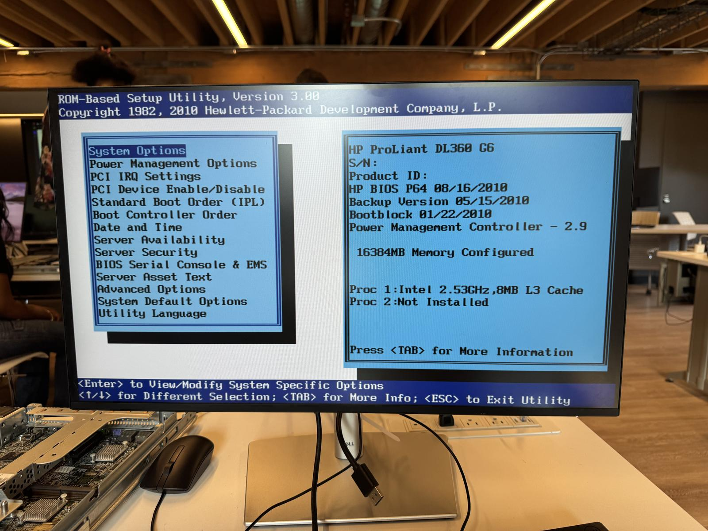

**HP ProLiant DL360 G6 : `Proc 2 Not Installed`.**

Cette vérification confirme que le BIOS reconnaît correctement la configuration avec un seul processeur.

---

## 🟢 **Étape 7 — Deuxième démarrage avec 2 CPU**

Le deuxième processeur est ensuite installé afin de vérifier si les deux CPU sont correctement détectés.

La configuration utilisée pour ce test est :

- **2 processeurs**
- **1 barrette RAM de 16 Go**

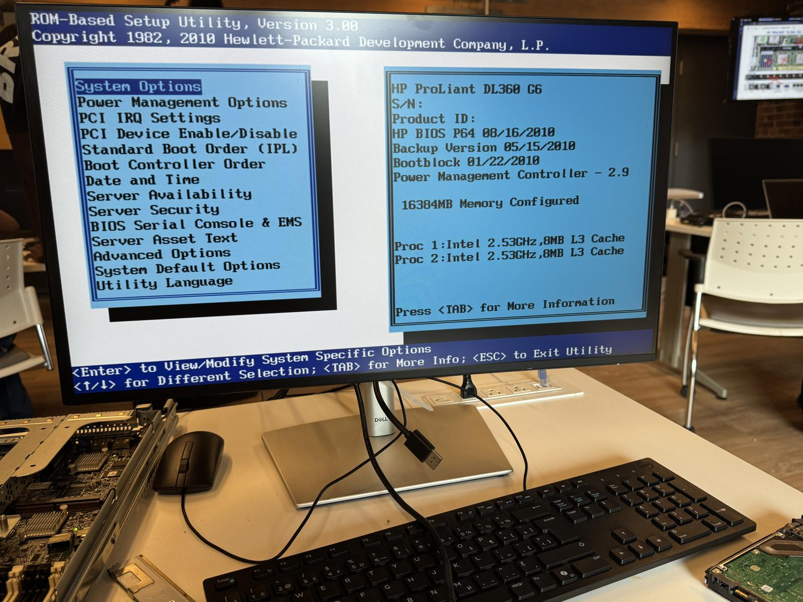

Le serveur affiche **16384 MB Memory Configured** et détecte correctement **Processor 1 et Processor 2**. ✅

---

# 💽 Partie 3 — Configuration du stockage RAID

## 🛠️ **Étape 8 — Accès au HP Array Configuration Utility**

L'utilitaire de configuration du contrôleur RAID est utilisé pour préparer les trois disques SAS.

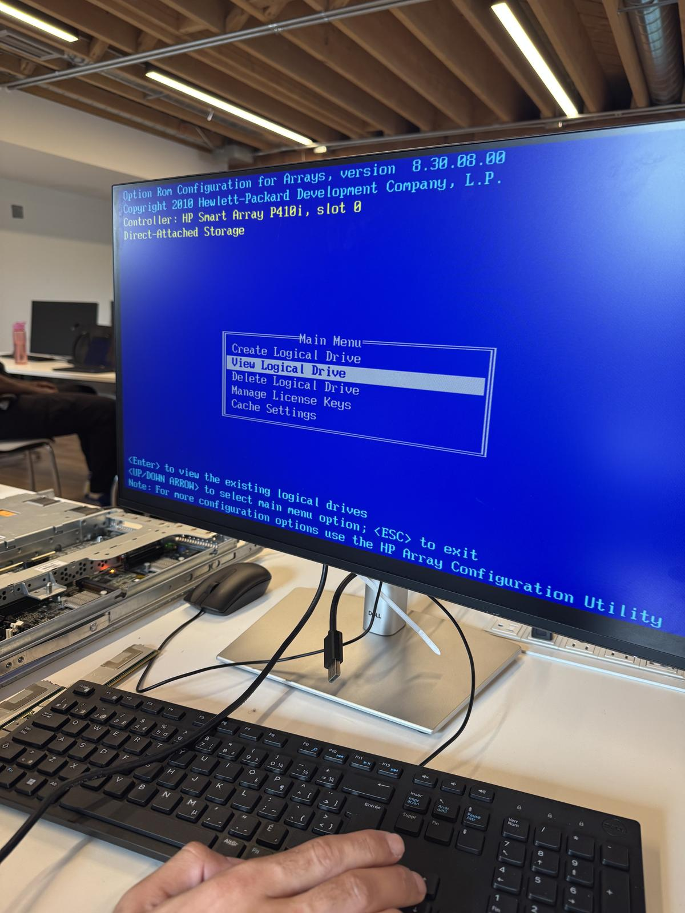

Le menu permet notamment de :

- créer un Logical Drive ;
- afficher la configuration ;
- supprimer un Logical Drive existant.

---

## 🗑️ **Étape 9 — Suppression de l'ancien volume RAID**

L'ancien **Logical Drive** est supprimé afin de pouvoir recréer correctement le volume de stockage.

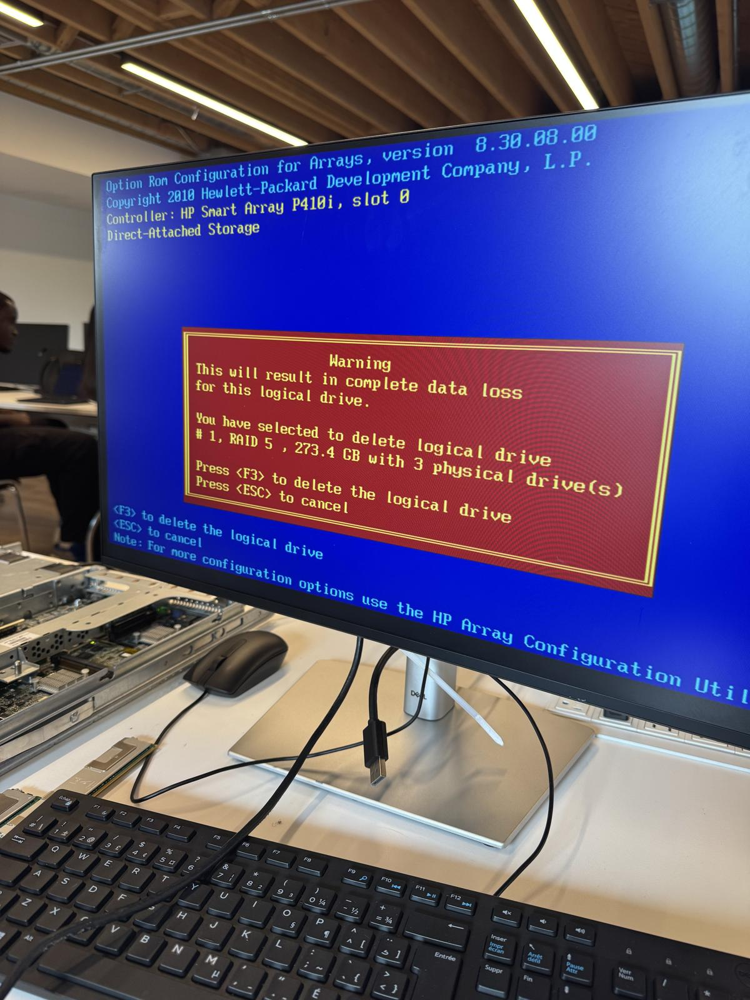

**Ancienne configuration : RAID 5 d'environ 273,4 Go.**

---

## 💿 **Étape 10 — Sélection des trois disques**

Les **trois disques SAS** sont sélectionnés pour créer le nouveau volume logique.

Le niveau de RAID choisi est :

### **RAID 5**

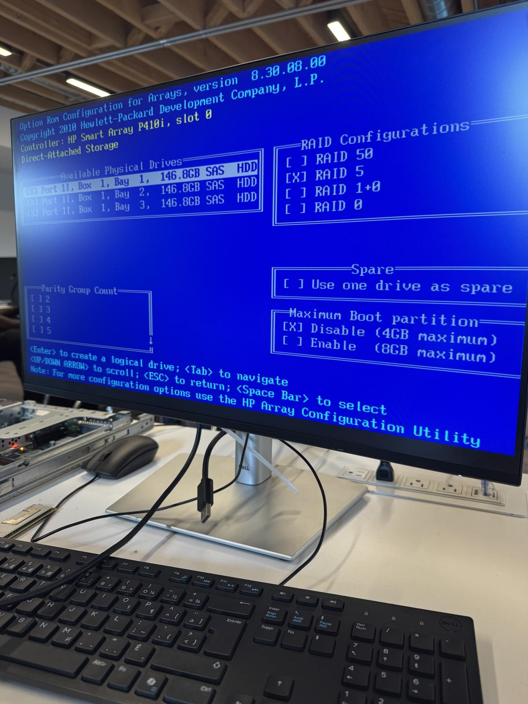

Le RAID 5 répartit les données et les informations de parité entre plusieurs disques.

---

## 💾 **Étape 11 — Sauvegarde de la configuration RAID**

La configuration sélectionnée est vérifiée avant d'être enregistrée.

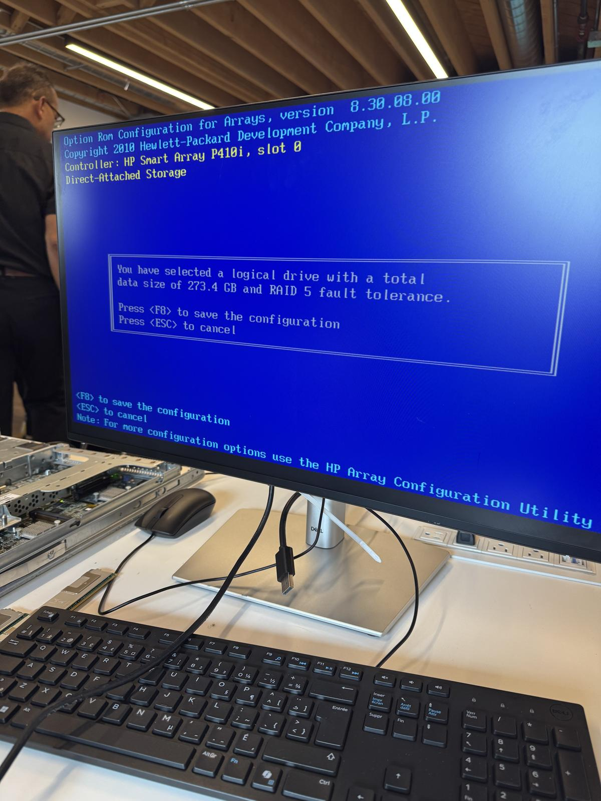

La touche **F8** permet de sauvegarder la nouvelle configuration.

---

## ✅ **Étape 12 — Vérification du Logical Drive**

Après la création du volume, le contrôleur RAID affiche le nouveau **Logical Drive**.

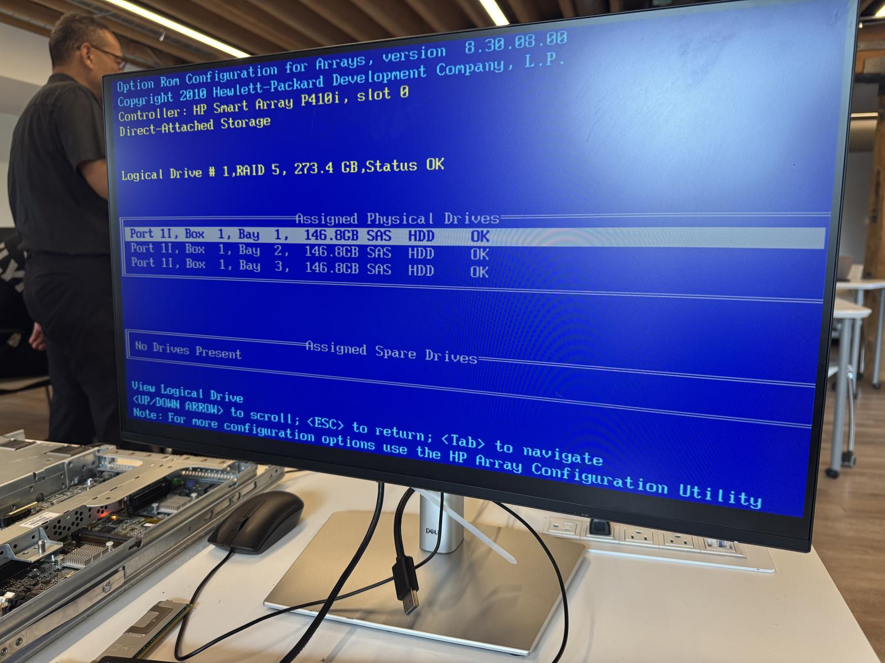

Configuration obtenue :

- **Logical Drive #1**
- **RAID 5**
- **Capacité : 273,4 Go**
- **Status : OK** ✅

Le volume RAID est donc correctement configuré.

---

# 🔩 Partie 4 — Remontage complet du serveur

## 🧠 **Étape 13 — Installation de toutes les barrettes RAM**

Après les différents tests, tous les composants sont réinstallés dans le serveur.

Un diagnostic mémoire est effectué pendant le démarrage.

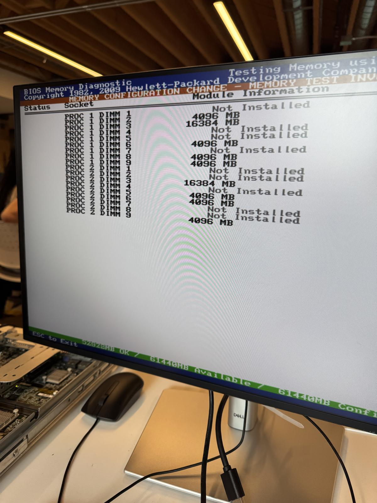

Le **BIOS Memory Diagnostic** indique environ :

```text
61440 MB Available
```

Cela correspond à environ **60 Go de mémoire disponible**.

---

## 🖥️ **Étape 14 — Vérification de la configuration finale**

Une dernière vérification est effectuée après le remontage complet du serveur.

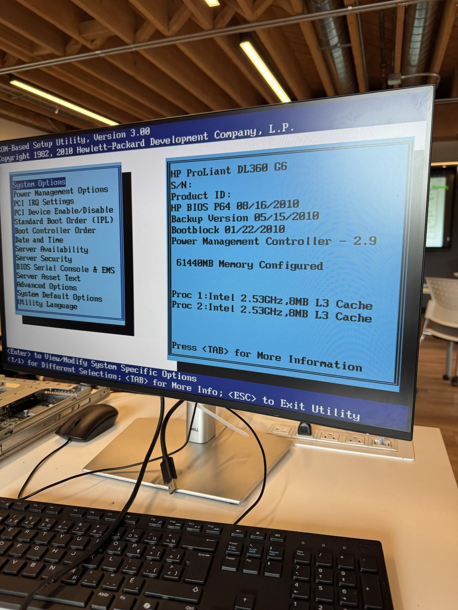

La configuration finale détectée comprend :

- 🧠 **environ 60 Go de RAM disponible**
- ⚙️ **2 processeurs Intel Xeon**
- 💽 **3 disques SAS configurés en RAID 5**
- 🔌 **2 blocs d'alimentation**

Le serveur reconnaît correctement les principaux composants installés. ✅

---

# 📊 Résultat final

| Composant | Configuration |
|---|---|
| 🖥️ Serveur | HP ProLiant DL360 G6 |
| ⚙️ Processeurs | 2 × Intel Xeon E5540 @ 2,53 GHz |
| 🧠 Mémoire installée | 2 × 16 Go + 8 × 4 Go |
| 🧠 Mémoire disponible observée | Environ 60 Go |
| 💽 Disques | 3 × SAS 146 Go |
| 🗄️ RAID | RAID 5 |
| 💾 Volume logique | Environ 273,4 Go |
| 🔌 Alimentations | 2 blocs d'alimentation HP |

---

# ✅ Conclusion

Ce laboratoire m'a permis de **démonter et remonter un serveur HP ProLiant DL360 G6** et d'identifier ses principaux composants matériels.

J'ai pu manipuler les **blocs d'alimentation, les disques SAS, la mémoire RAM, les processeurs et le contrôleur RAID**.

Les différents démarrages ont également permis de vérifier la détection du matériel dans le **BIOS**.

Enfin, les trois disques SAS ont été configurés en **RAID 5**, créant un volume logique d'environ **273,4 Go**.

Après le remontage, le serveur détecte correctement ses principaux composants et est prêt pour l'installation et la configuration d'un système d'exploitation. ✅
