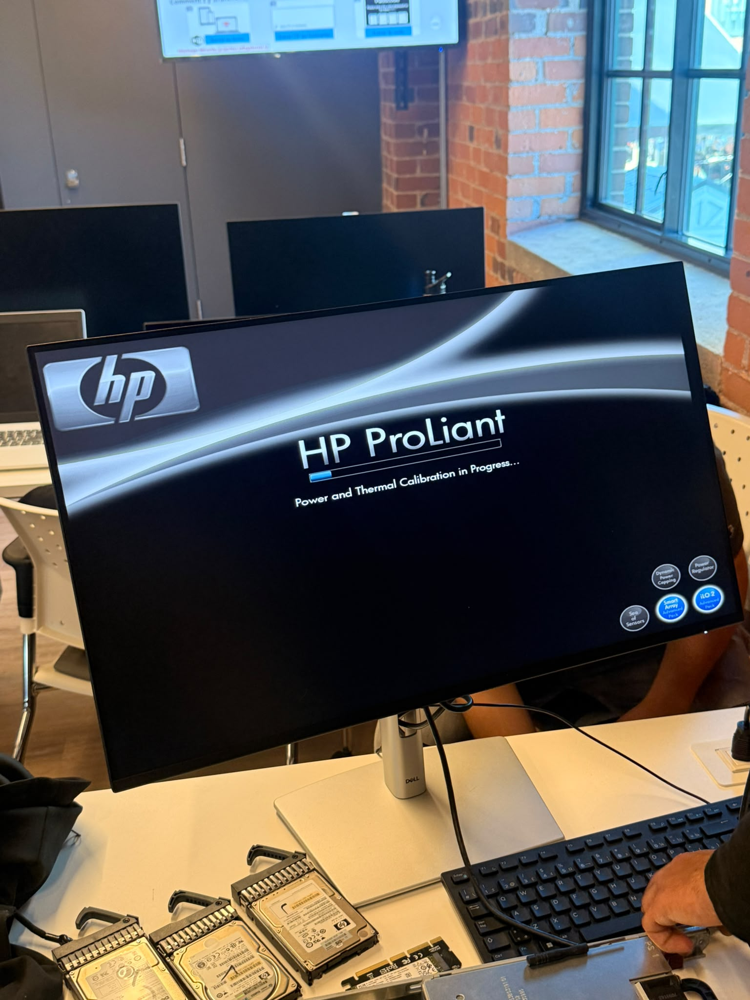
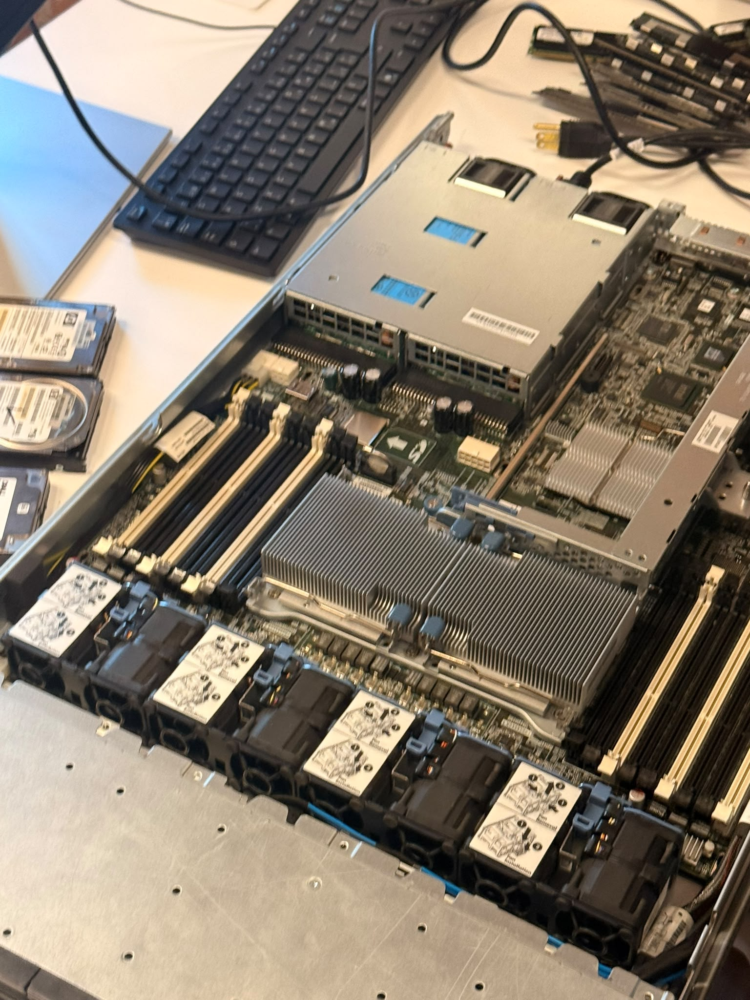

# 300156615

## Diagnostics

## Conclusion

Lorsqu'un serveur HP ProLiant DL360 G6 ne démarre pas, il faut diagnostiquer avant de démonter. Selon l'état du socket LGA1366, trois cas sont possibles :

- **Broches légèrement pliées** : on peut les redresser avec une loupe et une pince fine, sans frais.
- **Socket endommagé** : le remplacement demande un équipement de rework professionnel et coûte souvent plus cher que le serveur.
- **Carte système défectueuse** : la remplacer par une carte usagée est généralement la meilleure solution pour un G6.

Le test le plus efficace consiste à placer CPU2 seul dans le Socket 1 avec un DIMM dans le premier slot de CPU1. Il permet de savoir si le problème vient du processeur ou du socket. Les voyants du panneau avant et le comportement des ventilateurs aident aussi à identifier la cause.

J'ai retenu qu'une démarche méthodique, en éliminant les causes une à une, évite des réparations coûteuses et inutiles.
