# 300151315
# Installation de Proxmox VE 9.2 sur un HP ProLiant DL360 G6

Ce document décrit les étapes que nous avons suivies pour installer Proxmox VE 9.2 sur un serveur HP ProLiant DL360 G6, ainsi que les erreurs qui ont fait échouer l'installation.

## Caractéristiques du serveur

| Composant | Détails |
|---|---|
| Modèle | HP ProLiant DL360 G6 |
| Processeurs | 2 × Intel Xeon E5620 @ 2,40 GHz (8 cœurs au total, Hyper-Threading activé) |
| Mémoire RAM | 8 Go (2 barrettes par processeur) |
| Contrôleur RAID | HP Smart Array P410i (slot 0) |
| BIOS | HP P64 (05/05/2011) |
| Gestion à distance | iLO 2 v2.07 |

---

## 1. Travail matériel (manuel)

Nous avons ouvert le serveur et effectué le travail physique :

- Installation du **module de cache** sur le contrôleur RAID.
- Installation des **disques** dans les baies avant.
- Nous avons gardé seulement **2 barrettes de RAM par processeur** (4 au total).

**Leçon apprise :** les barrettes de RAM doivent être installées **dans l'ordre**, en suivant la numérotation des slots à côté de chaque processeur. Les installer en alternance ne fonctionne pas.

<p align="center">
  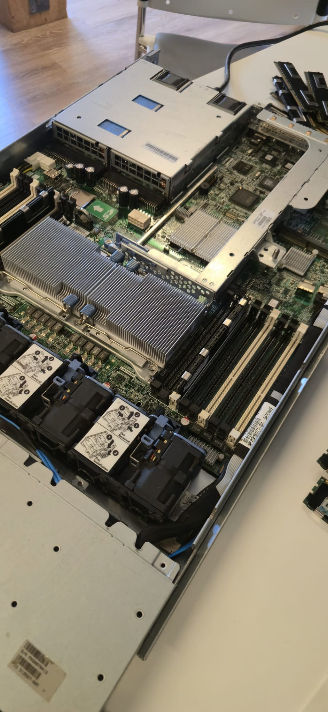
</p>

## 2. Vérification au POST

Au démarrage, l'écran POST a confirmé que le serveur détectait **8 Go de RAM** et **les deux processeurs**.

<p align="center">
  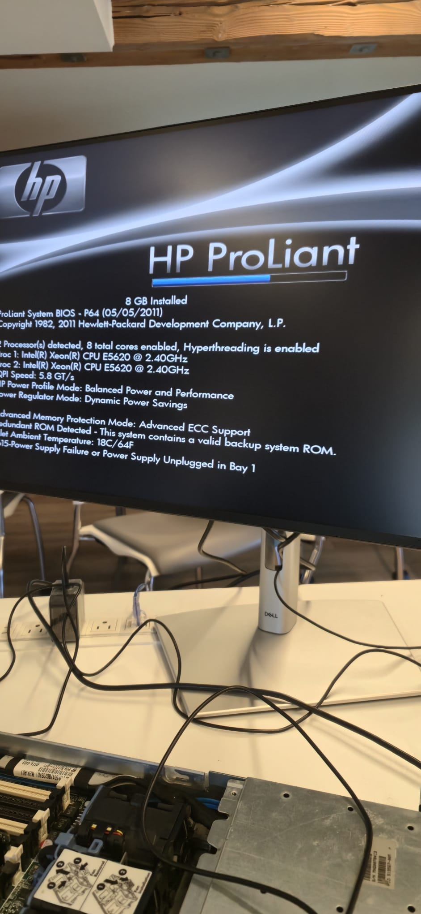
</p>

<p align="center">
  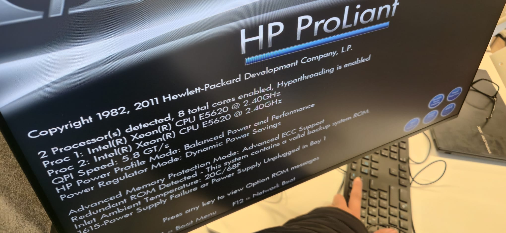
</p>

> Remarque : le message `1615-Power Supply Failure or Power Supply Unplugged in Bay 1` apparaît parce qu'une seule alimentation était branchée. Il ne bloque pas le démarrage.

## 3. BIOS (RBSU)

Nous avons vérifié la configuration du système dans l'utilitaire de configuration du BIOS (RBSU).

<p align="center">
  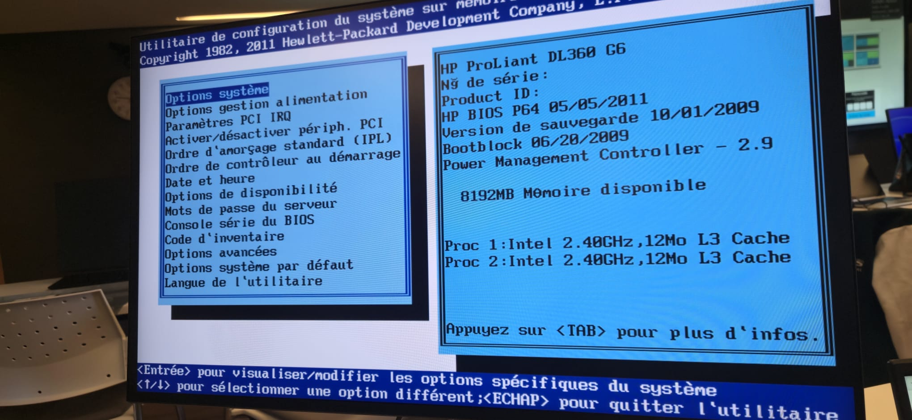
</p>

## 4. Configuration RAID (F8)

Au démarrage, le contrôleur **HP Smart Array P410i** est détecté. Nous avons appuyé sur **F8** pour accéder à l'utilitaire de configuration des grappes (ORCA) afin de formater les disques.

<p align="center">
  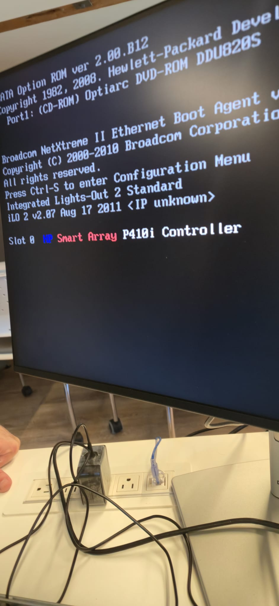
</p>

Le contrôleur a signalé un **déplacement de disque invalide** (*invalid drive movement*), car les disques provenaient d'une autre configuration. Nous avons accepté de perdre l'ancienne configuration.

<p align="center">
  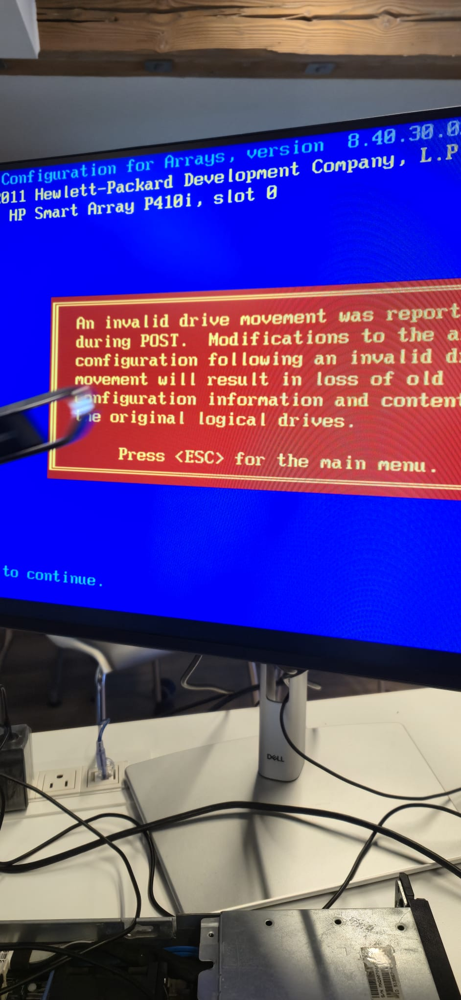
</p>

Nous avons créé un nouveau lecteur logique en **RAID 5** (293,56 Go) et l'avons enregistré avec **F8**.

<p align="center">
  
  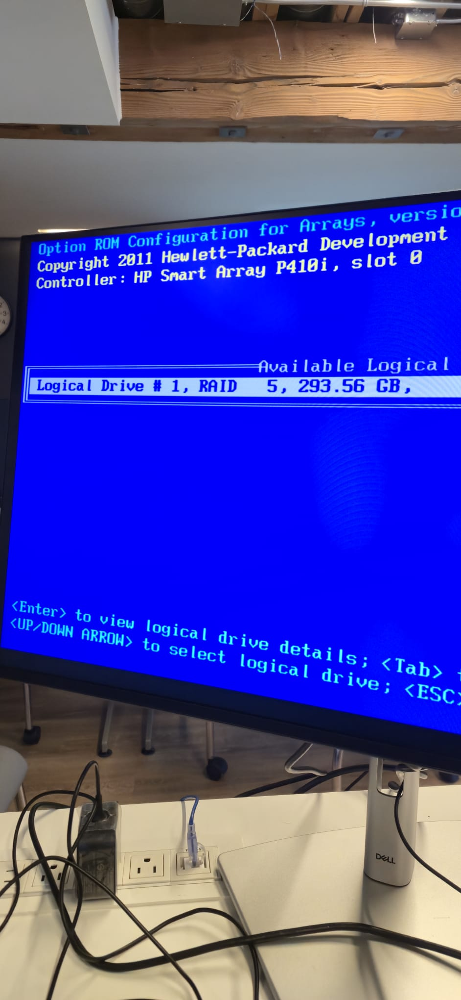
</p>

## 5. Clé USB bootable

Nous avons téléchargé l'**ISO de Proxmox VE 9.2** sur le site officiel et l'avons écrite sur une clé USB pour la rendre bootable.

<p align="center">
  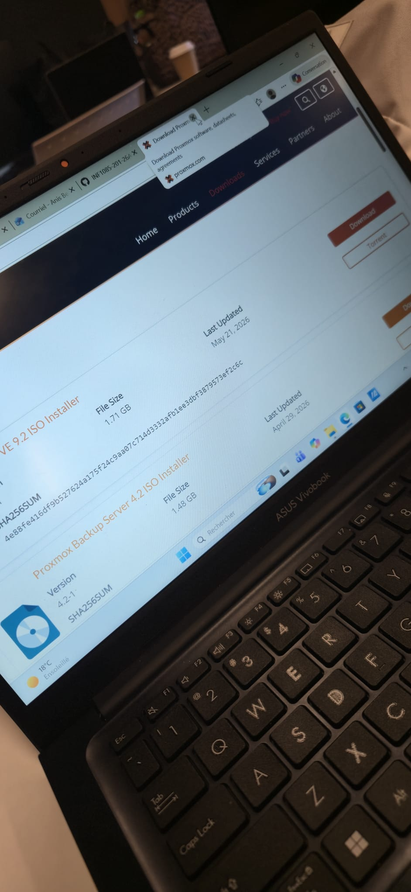
</p>

## 6. Démarrage sur la clé USB (F11)

Nous avons appuyé sur **F11** pendant le POST pour ouvrir le menu de démarrage, puis choisi **3) One Time Boot to USB DriveKey**.

<p align="center">
  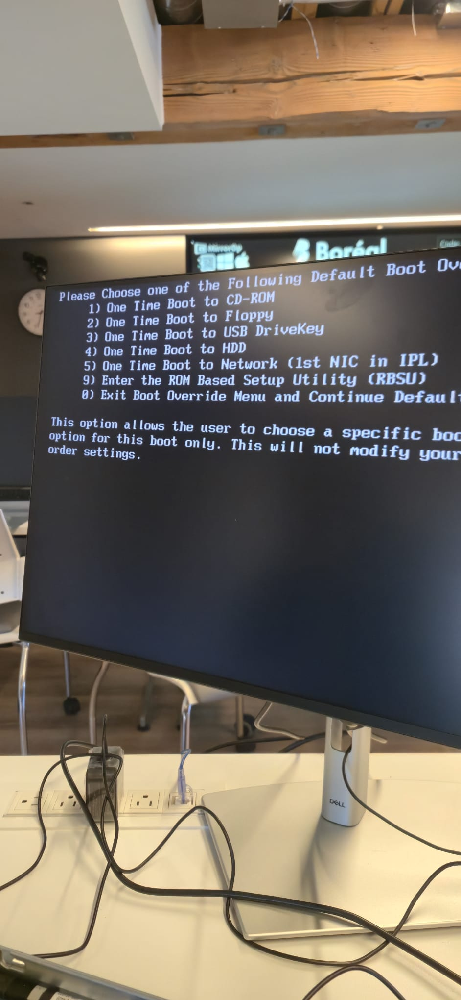
</p>

Le menu d'installation de Proxmox est apparu.

<p align="center">
  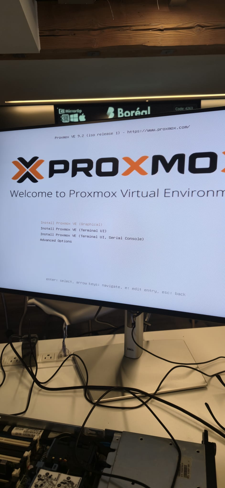
</p>

## 7. Modification de l'entrée GRUB

En suivant les instructions du cours, nous avons appuyé sur **e** sur *Install Proxmox VE (Graphical)*, ajouté `nomodeset acpi=off` à la fin de la ligne `linux`, puis démarré avec **Ctrl + X** (ou **F10**).

<p align="center">
  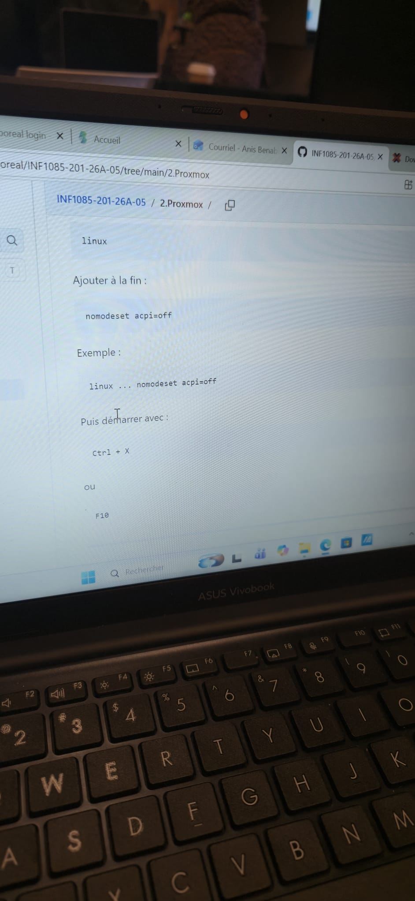
  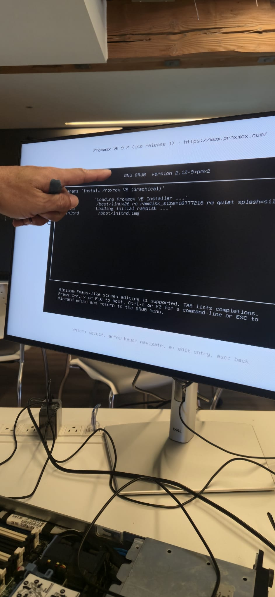
</p>

L'installateur a commencé à charger et a cherché l'ISO (d'abord sur `/dev/sr0`, le lecteur DVD).

<p align="center">
  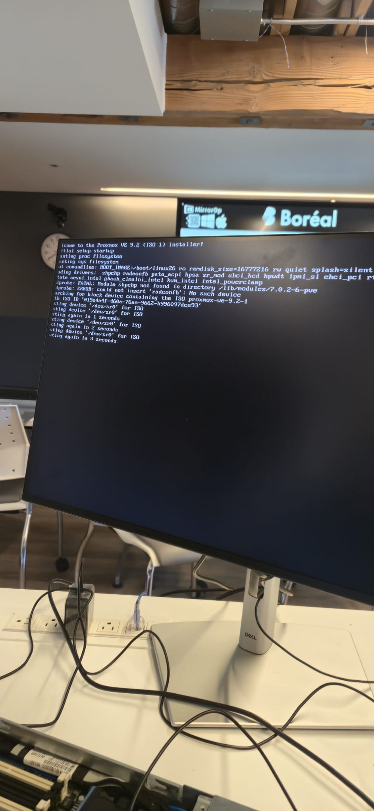
</p>

## 8. Installateur Proxmox

L'installateur a détecté le volume logique RAID 5 comme disque cible : `/dev/sda (273.40 GiB, LOGICAL VOLUME)`.

<p align="center">
  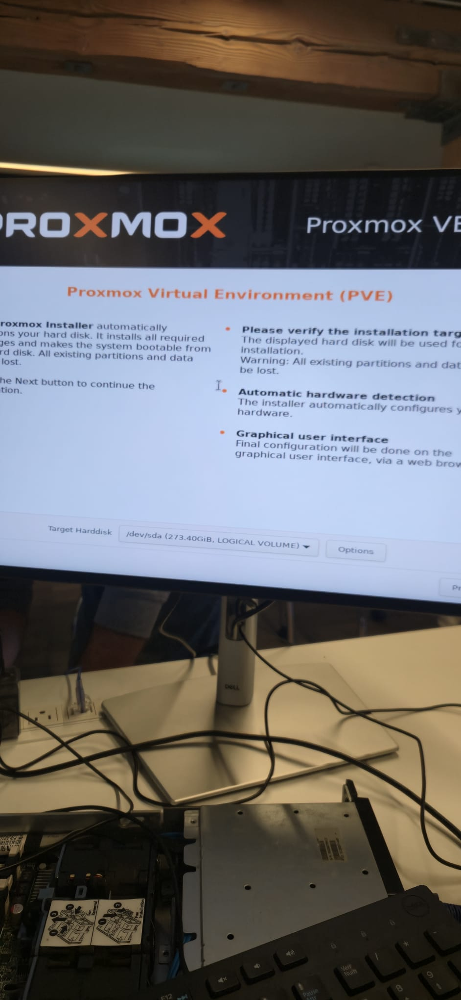
</p>

<p align="center">
  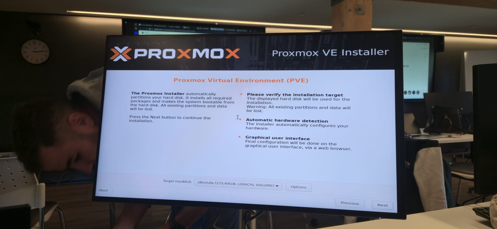
</p>

L'installation a commencé.

<p align="center">
  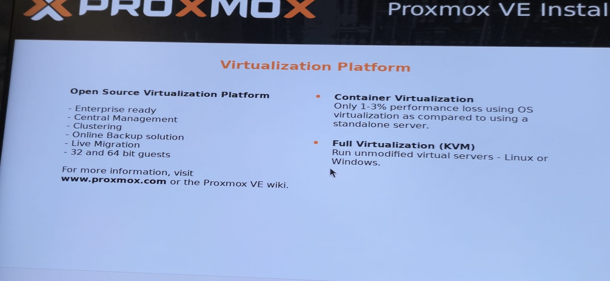
</p>

---

## 9. Erreurs (échec de l'installation)

### Erreur 1 : chargeur d'amorçage / initramfs

À la fin de l'installation, l'installateur a échoué avec :

```
bootloader setup errors:
unable to install initramfs
mount: /target/sys/firmware/efi/efivars: no mount point specified.
```

<p align="center">
  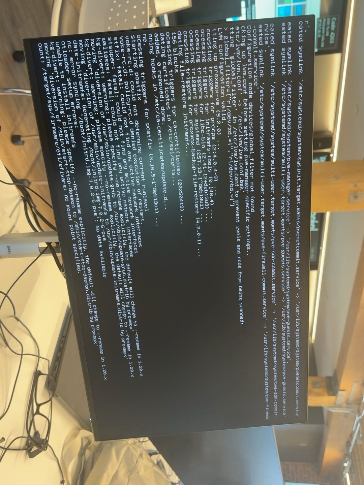
</p>

**Cause probable :** l'installateur a essayé de configurer un chargeur d'amorçage EFI, alors que le DL360 G6 ne supporte que le **BIOS legacy** (pas d'UEFI). L'option `acpi=off` peut aussi empêcher le système d'être correctement détecté.

### Erreur 2 : volume physique /dev/sda3

Lors de la tentative suivante, l'installation a échoué avec :

```
unable to initialize physical volume /dev/sda3
```

<p align="center">
  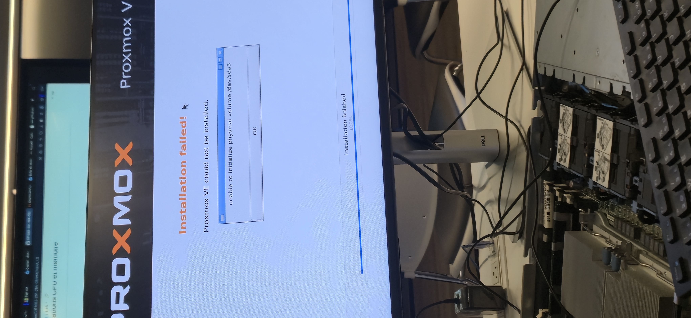
</p>

**Cause probable :** la première tentative échouée a laissé un ancien groupe de volumes LVM (`pve`) sur le disque, donc l'installateur n'a pas pu réutiliser la partition.

## 10. Problème de cache

Après ces erreurs, nous avons constaté que le **module de cache du contrôleur RAID ne fonctionnait pas correctement**. Un cache défectueux sur le Smart Array P410i peut causer des erreurs d'écriture sur le lecteur logique, ce qui pourrait expliquer pourquoi l'installateur n'a pas pu créer les partitions et le volume LVM.

Nous avons essayé de **remplacer le module de cache** par un autre, mais l'installation n'a toujours pas fonctionné.

## 11. Conclusion

L'installation de Proxmox VE 9.2 sur le HP ProLiant DL360 G6 n'a pas réussi. Nous avons fait de notre mieux et avons beaucoup appris sur le processus :

- Installer le matériel (disques, cache, RAM) et placer les barrettes de RAM **dans l'ordre**.
- Configurer un lecteur logique RAID 5 avec le contrôleur Smart Array (F8).
- Créer une clé USB bootable et démarrer dessus (F11).
- Modifier les options de démarrage GRUB (`nomodeset acpi=off`).
- Lire les erreurs de l'installateur pour comprendre d'où vient le problème.

## 12. La prochaine fois

- Tester d'abord le module de cache et le contrôleur (vérifier l'état du contrôleur au POST et dans ORCA).
- Utiliser un module de cache qui fonctionne à coup sûr, ou tester l'installation sans le cache.
- Supprimer et recréer le lecteur logique RAID avant chaque nouvelle tentative pour partir d'un disque propre.
- Recréer la clé USB en **mode image DD** (Rufus) ou avec Etcher.
- Essayer de démarrer avec seulement `nomodeset` (sans `acpi=off`).
- Si Proxmox 9.2 échoue encore sur ce vieux matériel, essayer une version plus ancienne de Proxmox (ex. 8.x).
