# 🖥️ Installation de Proxmox VE 9 sur un HP ProLiant DL360 G6

**Allouti Lounes**  
**Matricule :** 300151781  
**Programme :** TSIQ – Techniques des systèmes informatiques  

---

## 🎯 Objectif du laboratoire
L'objectif de ce laboratoire est d'installer Proxmox VE 9 sur un serveur HP ProLiant DL360 G6.  
Ce serveur étant relativement ancien, certains paramètres de démarrage sont nécessaires afin d'assurer la compatibilité avec le noyau Linux moderne utilisé par Proxmox[cite: 21].  
À la fin de l'installation, plusieurs commandes Linux sont utilisées pour vérifier le bon fonctionnement des processeurs, de la mémoire RAM, du stockage, des périphériques et du réseau[cite: 21, 32, 39].

---

## 🔧 Partie 1 — Préparation du serveur

### 🔌 Étape 1 — Démarrage du serveur HP ProLiant
Le serveur HP ProLiant DL360 G6 est démarré afin de vérifier son fonctionnement et d'accéder aux différentes options de configuration[cite: 3, 8].

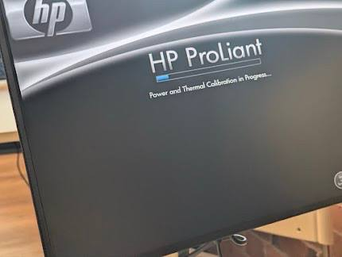[cite: 42]

---

### ⚙️ Étape 2 — Vérification de la configuration du serveur
Lors du démarrage, les informations matérielles du serveur sont vérifiées dans le BIOS avant de commencer l'installation[cite: 9, 10, 12].

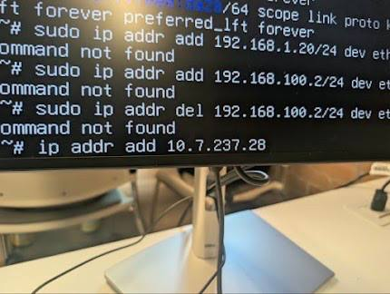[cite: 42]

---

### 💾 Étape 3 — Configuration du stockage
Le contrôleur de stockage intégré **HP Smart Array P410i** est configuré afin de préparer les disques pour l'installation[cite: 13, 15].

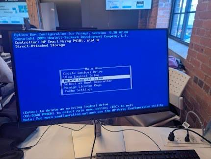[cite: 42]
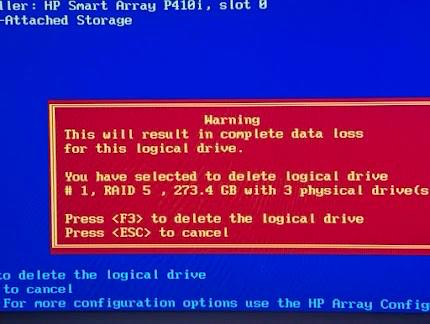[cite: 42]
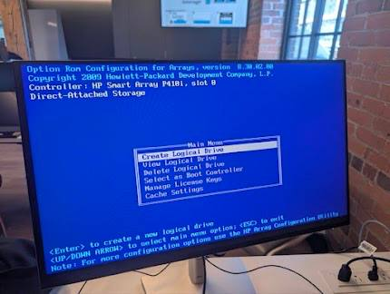[cite: 42]
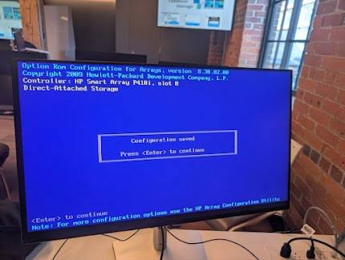[cite: 42]

---

## 🚀 Partie 2 — Installation de Proxmox VE 9

### 💿 Étape 4 — Démarrage sur le support d'installation
Création d'un support d'installation USB bootable avec l'image `proxmox-ve_9.2-1.iso` à l'aide de l'outil Rufus[cite: 11].

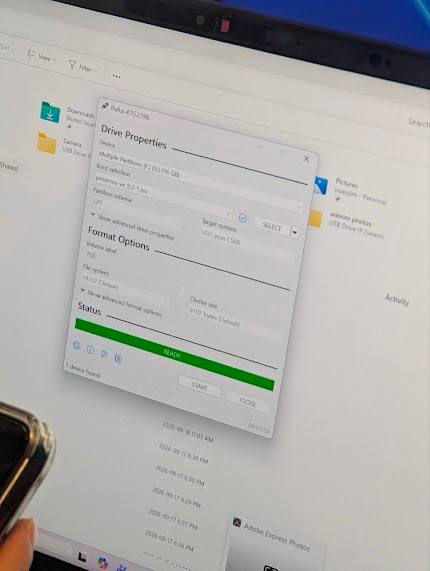[cite: 42]

---

### 🖥️ Étape 5 — Lancement de l'installateur Proxmox
Dans le menu de démarrage, l'installation de Proxmox VE est initialisée[cite: 21, 26].

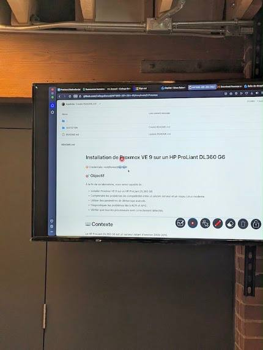[cite: 42]

---

### ⚙️ Étape 6 — Paramètres de compatibilité
Le serveur HP ProLiant DL360 G6 étant ancien, les paramètres de noyau suivants sont utilisés pour permettre un démarrage stable[cite: 21, 39] :
`nomodeset acpi=off`
- **`nomodeset`** : empêche l'initialisation avancée du mode graphique pendant le démarrage.
- **`acpi=off`** : désactive ACPI afin d'éviter les problèmes d'incompatibilité avec l'ancien BIOS du serveur.

---

### 💽 Étape 7 à 9 — Localisation et Utilisateur
Configuration du disque cible, du fuseau horaire, du clavier et du mot de passe `root`.

---

### 🌐 Étape 10 — Configuration du réseau
Saisie des paramètres réseau requis pour le serveur[cite: 32, 36] :
- **IP :** `10.7.237.28/23`[cite: 32, 36]
- **Passerelle (Gateway) :** `10.7.237.1`[cite: 36]
- **DNS :** `8.8.8.8`[cite: 36]

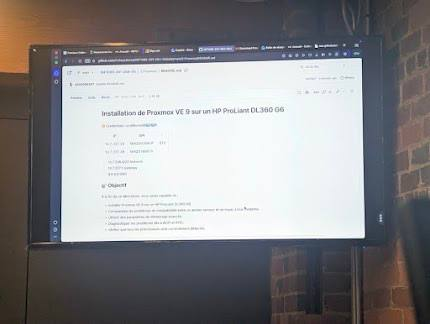[cite: 42]

---

## ⚠️ Partie 3 — Problème rencontré

### ⚠️ Étape 13 — Erreur d'initialisation du volume
Pendant l'installation, une erreur liée au sous-système de stockage est survenue[cite: 22] :
> **`Installation failed! Proxmox VE could not be installed.`**  
> **`unable to initialize physical volume /dev/sda3`**[cite: 22]

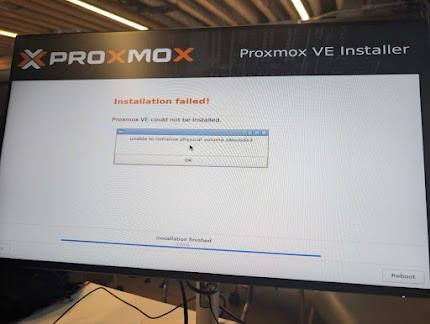[cite: 42]
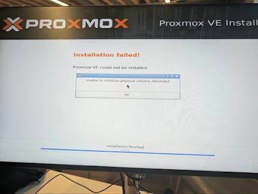[cite: 42]

Cette erreur indique que l'installateur n'a pas réussi à initialiser le volume physique LVM sur `/dev/sda3`[cite: 22]. Après réinitialisation complète de la grappe de disques sur le contrôleur RAID HP Smart Array[cite: 13, 17], la création de la table de partition a fonctionné et l'installation a pu se terminer[cite: 19, 20, 26].

---

## ✅ Partie 4 — Premier démarrage de Proxmox

### 🟢 Étape 14 — Démarrage réussi
Après la correction du stockage, le serveur redémarre correctement sous Proxmox Virtual Environment[cite: 26, 29].

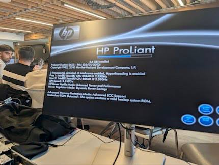[cite: 42]

---

## 🔍 Partie 5 — Vérification du système

### ⚙️ Étape 15 — Vérification des paramètres du noyau
Commande pour vérifier les paramètres réellement appliqués au démarrage du noyau Linux :
```bash
cat /proc/cmdline
