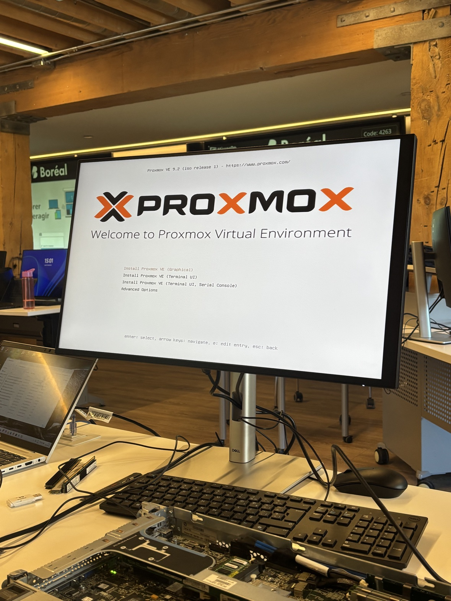
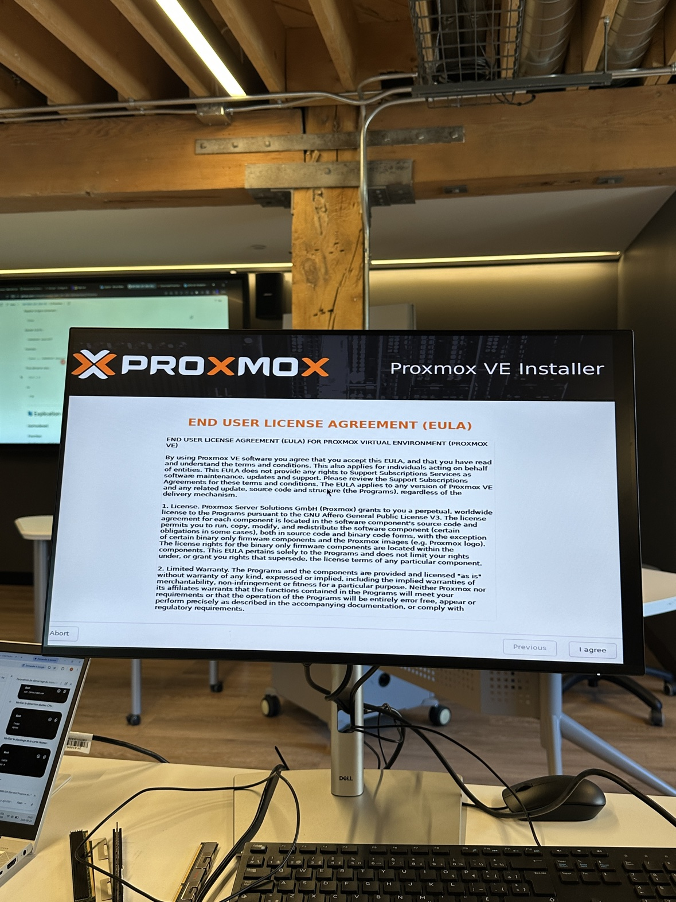
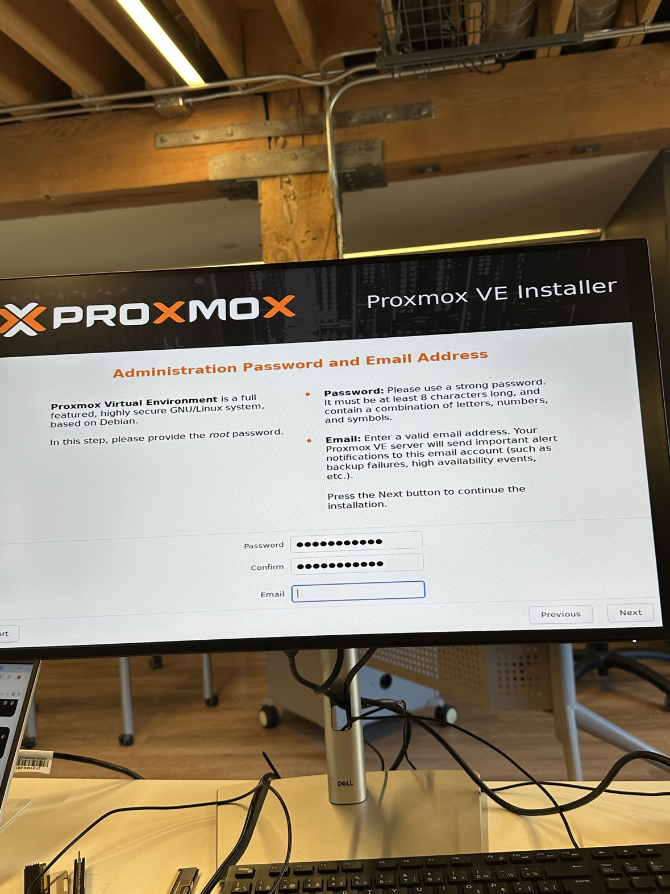
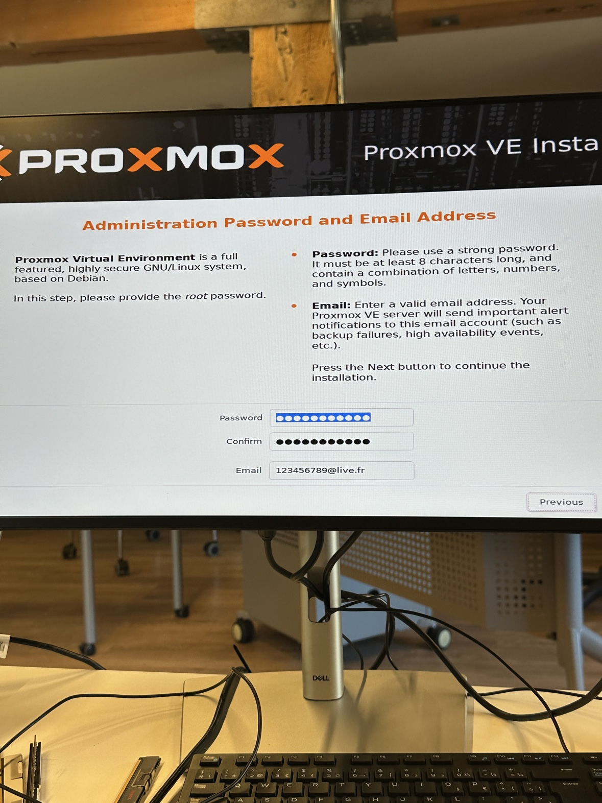
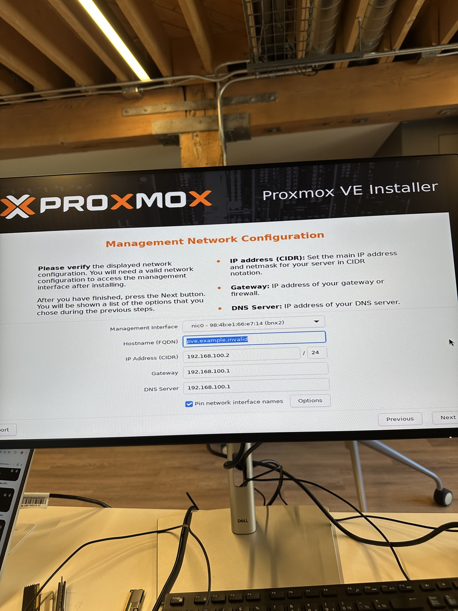
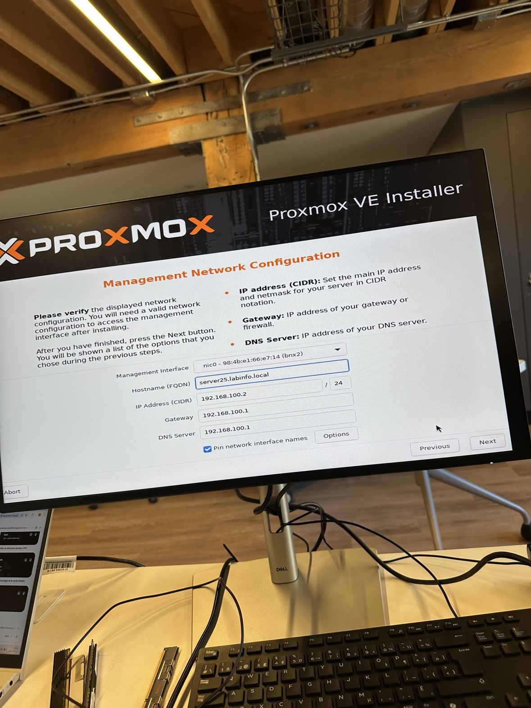
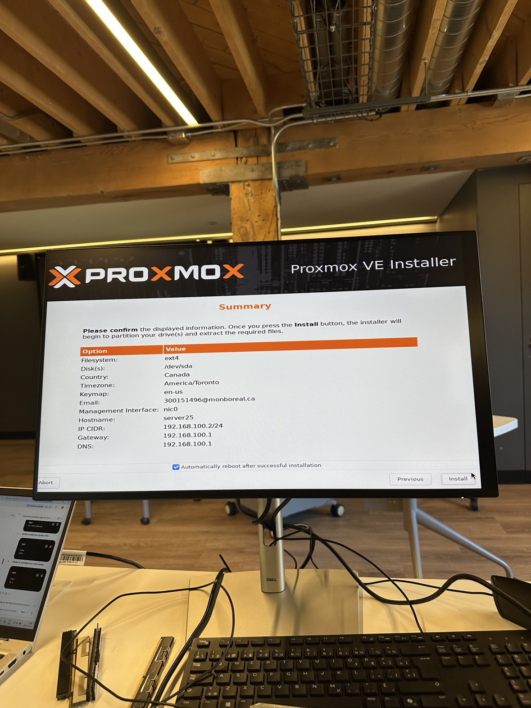
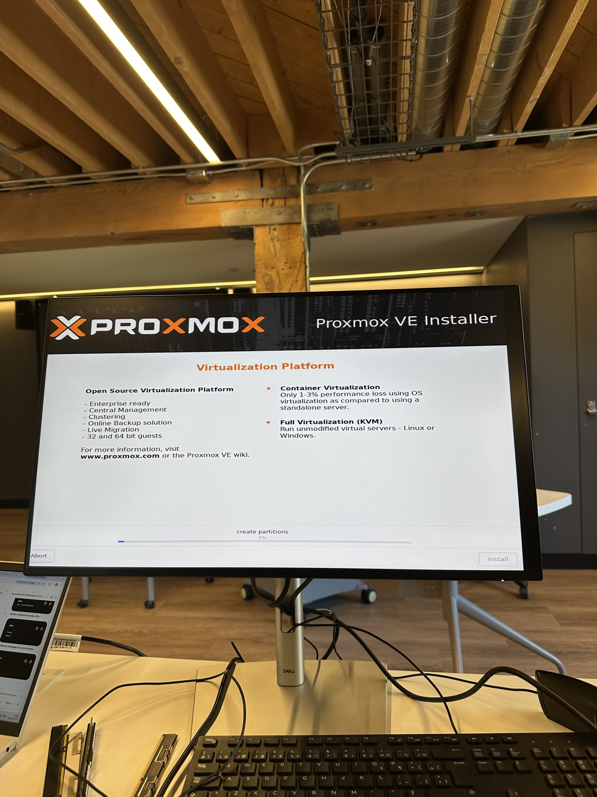
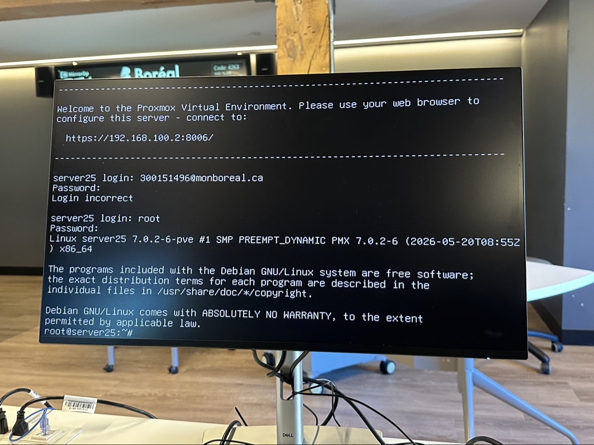
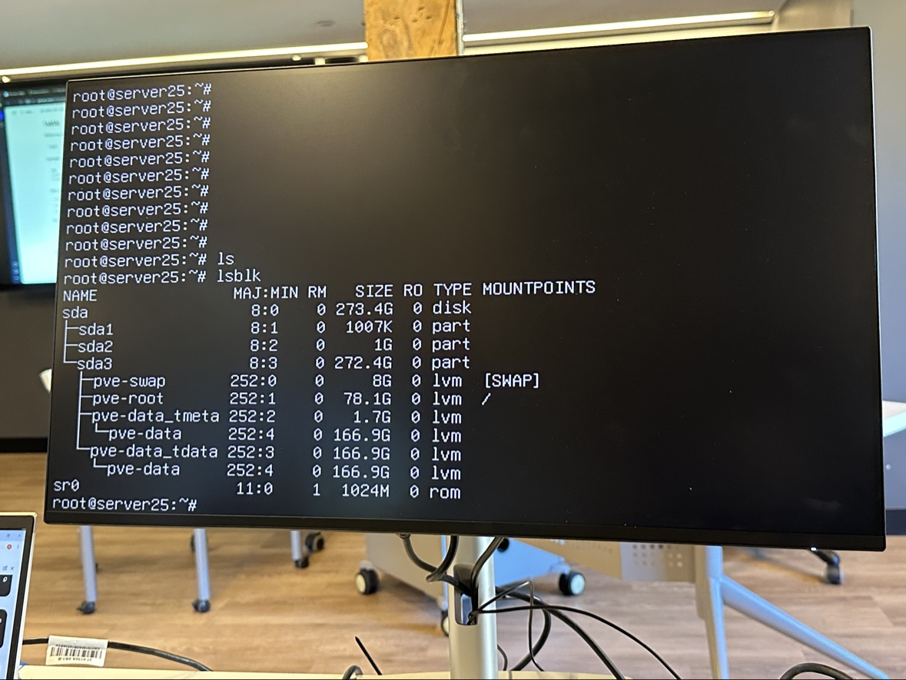

# 300155927

# Installation de Proxmox VE — serveur « server25 »

**Étudiant :** 300155927

**Date :** 24 septembre 2026

**Lieu :** Laboratoire (Boréal)

**Logiciel :** Proxmox VE 9.2 (ISO release 1), basé sur Debian (noyau 7.0.2-6-pve)

## 1. Contexte

Proxmox VE est une plateforme de virtualisation open source qui permet de faire
tourner plusieurs machines virtuelles (KVM) et conteneurs (LXC) sur un même
serveur physique. L'installation s'est faite depuis une clé USB d'installation,
directement sur le serveur.

> **Note :** les photos montrent quelques valeurs différentes entre elles
> (adresses courriel, nom d'hôte). C'est normal : il y a eu plusieurs passages
> et corrections pendant la manipulation en laboratoire.

## 2. Déroulement de l'installation, photo par photo

### Étape 1 — Menu de démarrage de la clé USB


Le serveur démarre sur la clé USB d'installation. L'écran « Welcome to Proxmox
Virtual Environment » propose plusieurs modes d'installation. On choisit
**Install Proxmox VE (Graphical)** pour une installation guidée à l'écran.

### Étape 2 — Licence d'utilisation (EULA)


Il faut accepter le contrat de licence (bouton **I agree**) avant de continuer.
Proxmox VE est un logiciel libre (licence GPLv3 pour l'essentiel), avec quelques
composantes propriétaires.

### Étapes 3 et 4 — Mot de passe administrateur et courriel



- **Password** : le mot de passe du compte `root`, l'administrateur du serveur.
  Il doit contenir au moins 8 caractères (lettres, chiffres et symboles).
- **Email** : l'adresse qui recevra les alertes du serveur (échecs de
  sauvegarde, événements de haute disponibilité, etc.).

### Étapes 5 et 6 — Configuration réseau de gestion



C'est l'étape la plus importante : elle définit comment on accédera au serveur
après l'installation.

| Paramètre | Valeur par défaut (photo 5) | Valeur finale (photo 6) |
|---|---|---|
| Interface de gestion | nic0 (carte bnx2) | nic0 |
| Nom d'hôte (FQDN) | pve.example.invalid | **server25.labinfo.local** |
| Adresse IP (CIDR) | 192.168.100.2 / 24 | 192.168.100.2 / 24 |
| Passerelle | 192.168.100.1 | 192.168.100.1 |
| Serveur DNS | 192.168.100.1 | 192.168.100.1 |

Le nom d'hôte par défaut `pve.example.invalid` a été remplacé par
`server25.labinfo.local`, le vrai nom de la machine dans le réseau du labo.

### Étape 7 — Résumé avant installation


L'installateur affiche un récapitulatif de tous les choix avant de lancer
l'installation définitive :

- Système de fichiers : **ext4**, disque **/dev/sda**
- Pays : Canada, fuseau horaire : **America/Toronto**, clavier : en-us
- Nom d'hôte : **server25**
- Réseau : 192.168.100.2/24, passerelle et DNS : 192.168.100.1

Le bouton **Install** lance le partitionnement du disque et la copie des
fichiers. La case « Automatically reboot after successful installation » est
cochée : le serveur redémarrera tout seul à la fin.

### Étape 8 — Installation en cours


L'installateur crée les partitions du disque (« create partitions ») puis copie
les fichiers du système. Il ne reste qu'à attendre la fin et le redémarrage
automatique.

### Étape 9 — Premier démarrage et première connexion


Au redémarrage, l'écran affiche :

> Welcome to the Proxmox Virtual Environment. Please use your web browser to
> configure this server - connect to: **https://192.168.100.2:8006/**

C'est l'adresse de l'interface d'administration web de Proxmox.

On y voit aussi une erreur instructive : une première tentative de connexion
avec l'adresse courriel comme identifiant échoue (**Login incorrect**). C'est
normal : Proxmox attend ici le nom d'utilisateur **`root`** (le courriel sert
uniquement à recevoir les alertes, pas à se connecter). La connexion en `root`
réussit ensuite et affiche l'invite `root@server25:~#`.

### Étape 10 — Vérification des disques avec `lsblk`


La commande `lsblk` liste les disques et leurs partitions. Voici ce qu'elle
révèle sur server25 :

- **sda** : le disque dur, 273,4 Go
  - **sda1** (1007K) : petite partition de démarrage (BIOS boot)
  - **sda2** (1G) : partition `/boot` (démarrage EFI)
  - **sda3** (272,4G) : volume physique LVM, qui contient :
    - **pve-swap** (8G, `[SWAP]`) : mémoire d'échange (swap)
    - **pve-root** (78,1G, monté sur `/`) : le système d'exploitation
    - **pve-data** (166,9G) : pool « thin » LVM qui stockera les disques des
      machines virtuelles et conteneurs (`pve-data_tmeta` = métadonnées,
      `pve-data_tdata` = données du pool)
- **sr0** (1024M, rom) : le lecteur DVD

C'est le partitionnement standard créé automatiquement par l'installateur
Proxmox : le système est séparé de l'espace réservé aux VM.

## 3. Configuration finale

| Paramètre | Valeur |
|---|---|
| Nom d'hôte | server25 (server25.labinfo.local) |
| Adresse IP | 192.168.100.2/24 |
| Passerelle / DNS | 192.168.100.1 |
| Interface web | https://192.168.100.2:8006/ |
| Utilisateur admin | root |
| Disque | 273,4 Go (système 78 Go, VM 167 Go, swap 8 Go) |

## 4. Structure du dépôt

```
.
├── README.md          ← ce document
└── images/            ← les 10 photos de l'installation
```
