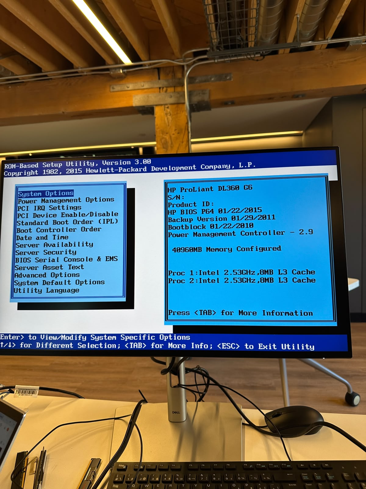
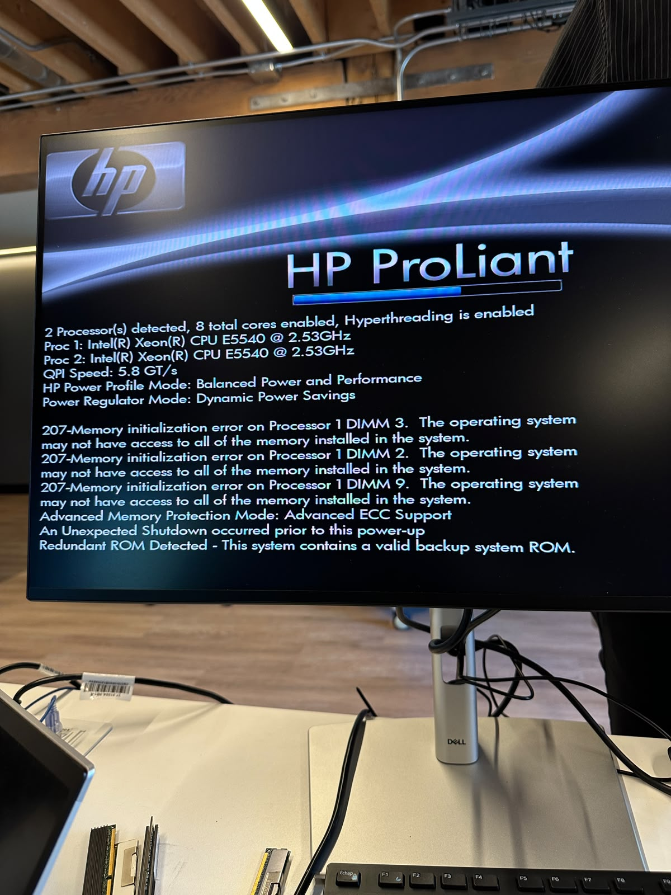
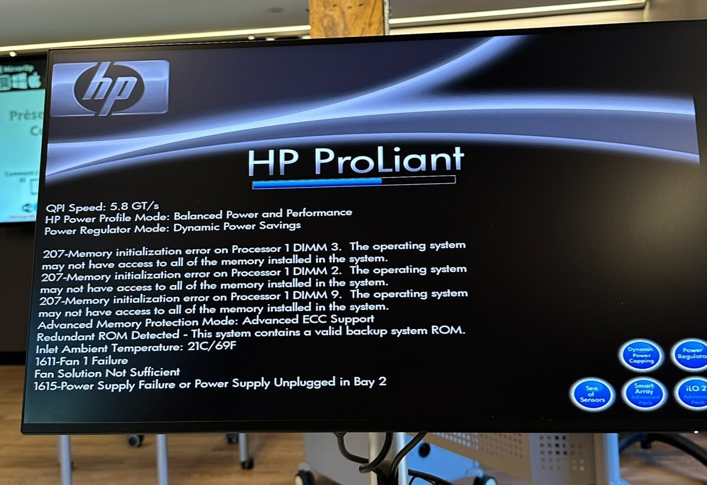
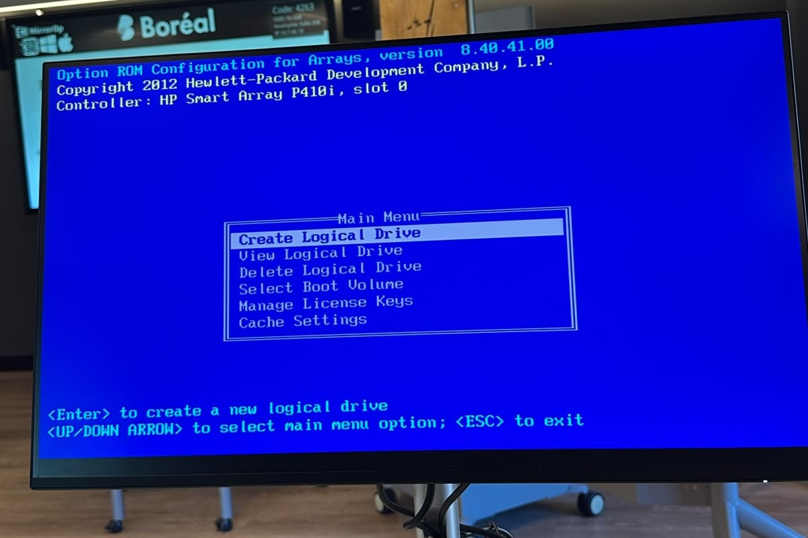
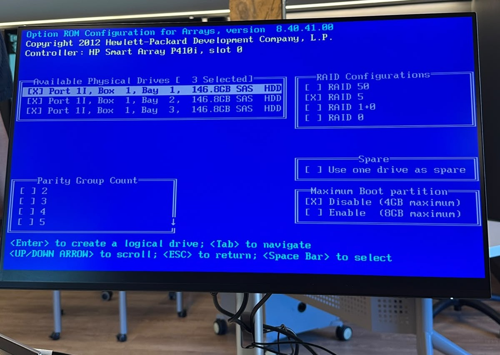
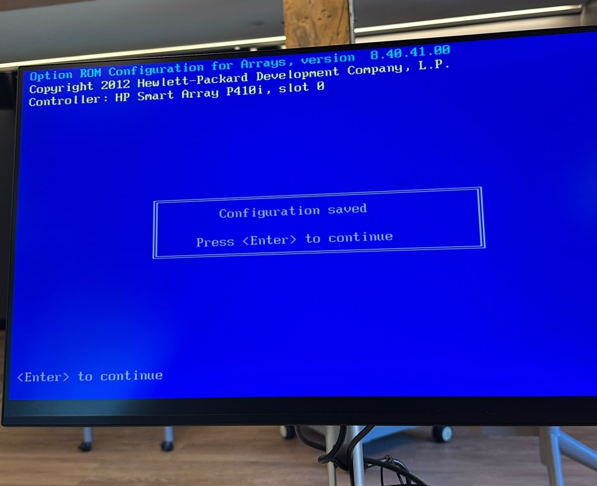
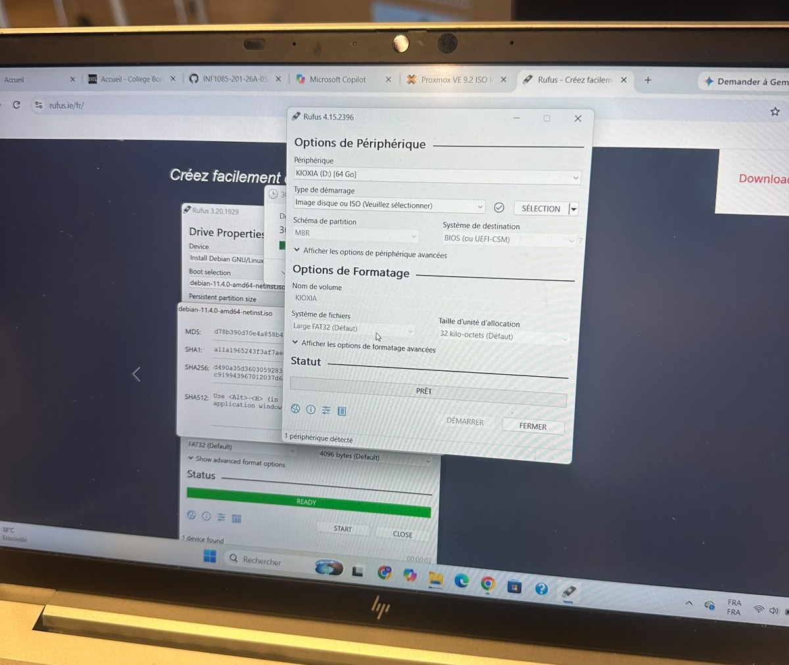
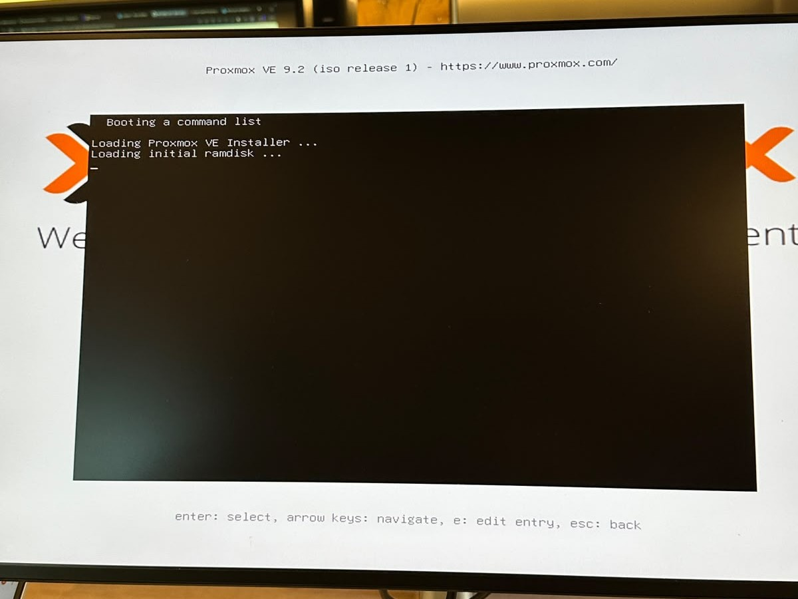

# 300156187
# Installation de Proxmox VE 9.2 sur un HP ProLiant DL360 G6

Documentation technique d’un laboratoire de virtualisation réalisé sur un serveur **HP ProLiant DL360 G6**. Le projet couvre le diagnostic matériel, la création d’un volume RAID 5, la préparation de la clé USB et le démarrage de l’installateur Proxmox VE 9.2.

## Table des matières

- [1. Objectif du projet](#1-objectif-du-projet)
- [2. Informations système](#2-informations-système)
- [3. Diagnostic au démarrage](#3-diagnostic-au-démarrage)
- [4. Configuration du RAID 5](#4-configuration-du-raid-5)
- [5. Préparation de la clé USB](#5-préparation-de-la-clé-usb)
- [6. Démarrage de Proxmox VE](#6-démarrage-de-proxmox-ve)
- [7. Suite de l’installation](#7-suite-de-linstallation)
- [8. Vérifications après installation](#8-vérifications-après-installation)
- [9. Dépannage](#9-dépannage)
- [10. Résumé](#10-résumé)

## 1. Objectif du projet

L’objectif est de transformer un serveur physique en plateforme de virtualisation pour un laboratoire informatique. Proxmox VE permettra ensuite de créer et d’administrer des machines virtuelles et des conteneurs à partir d’une interface Web.

**Étapes réalisées :**

1. Vérification des composants détectés au démarrage.
2. Analyse des alertes matérielles.
3. Création d’un volume logique RAID 5.
4. Préparation d’une clé USB d’installation avec Rufus.
5. Démarrage de l’installateur Proxmox VE 9.2.

---

## 2. Informations système

| Composant | Configuration observée |
|---|---|
| Serveur | HP ProLiant DL360 G6 |
| Processeurs | 2 × Intel Xeon E5540 |
| Fréquence | 2,53 GHz |
| Cœurs | 8 cœurs au total |
| Hyper-Threading | Activé |
| Mémoire détectée | 40 960 Mo |
| Contrôleur RAID | HP Smart Array P410i |
| Disques | 3 × 146,8 Go SAS |
| Volume logique | RAID 5, 293,56 Go |
| Hyperviseur | Proxmox VE 9.2 |

  
  
<em>Figure 1 — Le BIOS détecte les deux processeurs Intel Xeon E5540 et 40 960 Mo de mémoire.</em>

---

## 3. Diagnostic au démarrage

Le POST signale plusieurs problèmes matériels à corriger avant d’utiliser le serveur de façon intensive.

### 3.1 Erreurs de mémoire

Les messages `207-Memory initialization error` concernent les emplacements **DIMM 2, DIMM 3 et DIMM 9 du processeur 1**. Le système avertit que toute la mémoire installée pourrait ne pas être accessible.

  
  
<em>Figure 2 — Erreurs d’initialisation sur trois emplacements DIMM du processeur 1.</em>

**Actions recommandées :**

1. Éteindre le serveur et débrancher l’alimentation.
2. Retirer puis réinsérer les barrettes concernées.
3. Vérifier l’ordre de peuplement indiqué sur le capot du serveur.
4. Tester les barrettes une par une pour isoler une barrette ou un emplacement défectueux.
5. Relancer le diagnostic mémoire et confirmer la quantité réellement détectée.

### 3.2 Ventilation et alimentation

Le POST affiche également :

- `1611-Fan 1 Failure` : le ventilateur 1 est absent, mal branché ou défectueux.
- `Fan Solution Not Sufficient` : la ventilation disponible est insuffisante.
- `1615-Power Supply Failure or Power Supply Unplugged in Bay 2` : la seconde alimentation n’est pas opérationnelle.

  
  
<em>Figure 3 — Alertes concernant la mémoire, le ventilateur 1 et l’alimentation de la baie 2.</em>

 

## 4. Configuration du RAID 5

Le contrôleur **HP Smart Array P410i** est configuré avec trois disques SAS de 146,8 Go. Le RAID 5 répartit les données et la parité sur les trois disques. Il fournit une capacité utile d’environ 293,56 Go et tolère la panne d’un disque.

### 4.1 Création du volume logique

Dans l’utilitaire **Option ROM Configuration for Arrays (ORCA)** :

1. Ouvrir `Create Logical Drive`.
2. Sélectionner les trois disques physiques.
3. Choisir `RAID 5`.
4. Conserver la partition de démarrage activée.
5. Valider la création du volume logique.

  
  
<em>Figure 4 — Menu principal de l’utilitaire HP Smart Array.</em>

 

  
  
<em>Figure 5 — Trois disques de 146,8 Go sélectionnés pour le RAID 5.</em>

   

### 4.2 Validation

Après l’enregistrement, l’utilitaire affiche un volume logique de **293,56 Go** avec l’état `OK`.

  
  
<em>Figure 6 — Enregistrement de la configuration RAID.</em>

 

  
  
<em>Figure 7 — Volume logique RAID 5 reconnu et opérationnel.</em>

   

---

## 5. Préparation de la clé USB

Une clé USB est préparée sous Windows avec **Rufus**.

### Paramètres

| Champ | Valeur |
|---|---|
| Périphérique | Clé USB sélectionnée |
| Image de démarrage | ISO Proxmox VE 9.2 |
| Schéma de partition | MBR |
| Système cible | BIOS ou UEFI-CSM |
| Système de fichiers | FAT32 par défaut |

  
  
<em>Figure 8 — Rufus avant la sélection de l’image ISO.</em>

   

**Procédure :**

1. Télécharger l’image ISO officielle de Proxmox VE.
2. Brancher la clé USB et ouvrir Rufus.
3. Vérifier que le bon périphérique USB est sélectionné.
4. Cliquer sur `SÉLECTION`, puis choisir l’ISO Proxmox VE 9.2.
5. Utiliser le schéma `MBR` et la cible `BIOS (ou UEFI-CSM)` pour ce serveur.
6. Cliquer sur `DÉMARRER` et confirmer l’effacement de la clé.
7. Attendre l’état `PRÊT`, puis éjecter la clé correctement.

> [!CAUTION]
> La création du média efface le contenu de la clé USB. Vérifier le périphérique choisi avant de démarrer l’écriture.

---

## 6. Démarrage de Proxmox VE

1. Insérer la clé USB dans le serveur.
2. Démarrer ou redémarrer le HP ProLiant.
3. Sélectionner la clé USB comme périphérique de démarrage.
4. Dans le menu Proxmox, choisir `Install Proxmox VE (Graphical)`.

  
  
<em>Figure 9 — Menu principal de l’installateur Proxmox VE 9.2.</em>

   

L’écran suivant confirme le chargement de l’installateur et de l’image `initrd`.

  
  
<em>Figure 10 — Chargement de l’installateur Proxmox VE.</em>

   

---
