# 🖥️ Création d'une VM Ubuntu Server sur Proxmox VE

**Nom :** Ouassim Ahmed Benamira  
**Matricule :** 300150564  
**Programme :** TSIQ – Techniques des systèmes informatiques  

---

## 🎯 **Objectif**

Créer une machine virtuelle **Ubuntu Server 24.04.5 LTS** sur le serveur **Proxmox VE 9.2.2**.

---

## 🔐 **Étape 1 — Connexion au serveur Proxmox**

Connexion au serveur `server56` avec SSH :

```bash
ssh root@10.7.237.200
```

Vérification du réseau et de la version de Proxmox :

```bash
ip a
pveversion
```

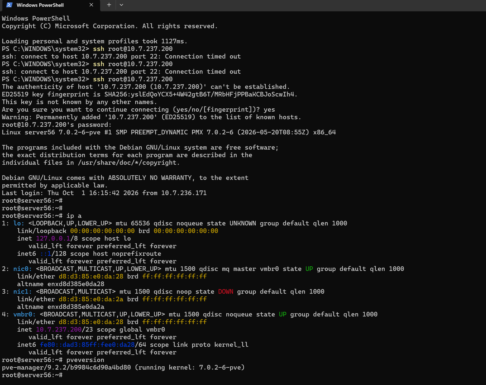

**Adresse IP du serveur :** `10.7.237.200/23` ✅

---

## 🌐 **Étape 2 — Accès à l'interface Proxmox**

Connexion à l'interface Web de **Proxmox VE 9.2.2** et sélection du serveur `server56`.

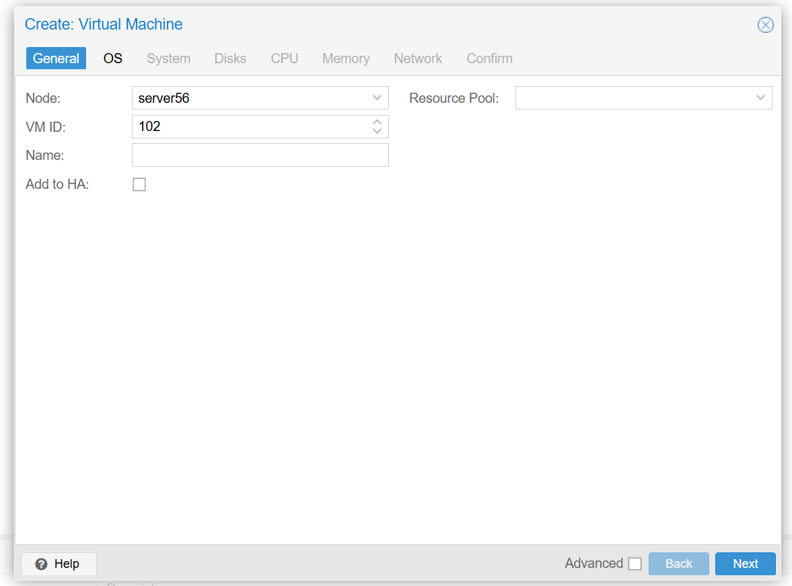

---

## 📀 **Étape 3 — Ajout de l'image ISO Ubuntu**

Dans le stockage :

**server56 → local (server56) → ISO Images**

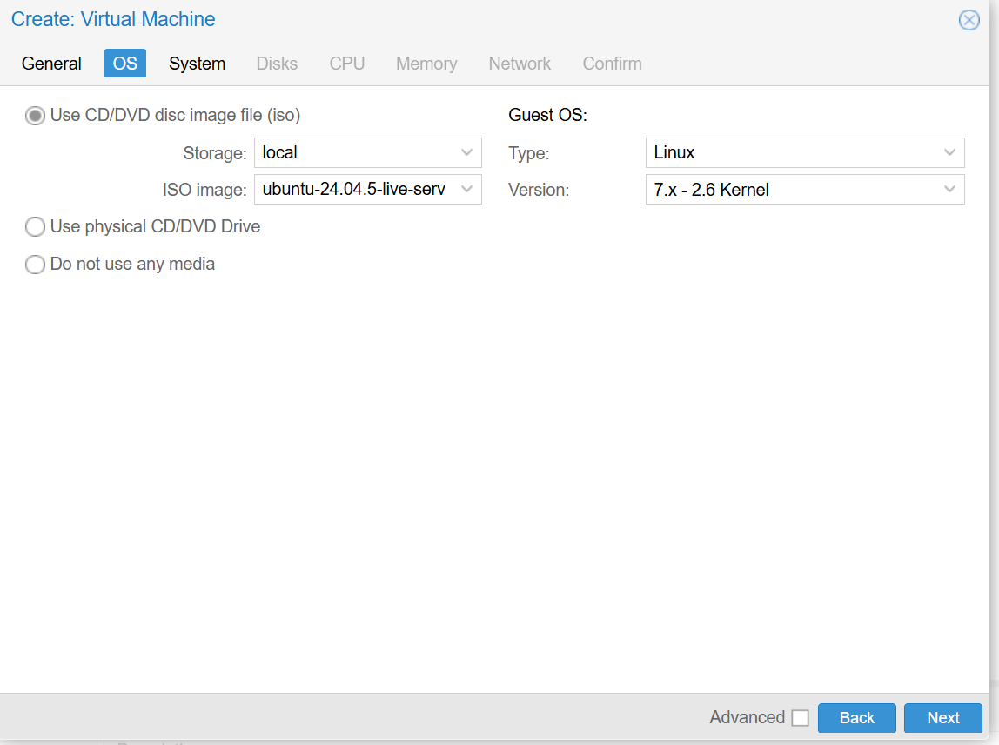

Téléversement de l'image ISO **Ubuntu Server 24.04.5 LTS**.

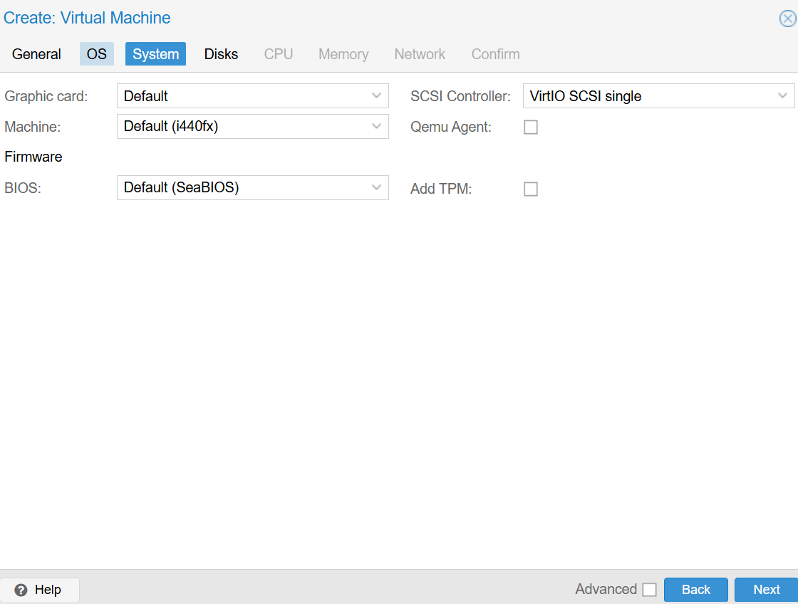

---

## 🖥️ **Étape 4 — Création de la machine virtuelle**

Création d'une nouvelle VM sur le serveur `server56`.

La machine virtuelle est nommée **Ouassim**.

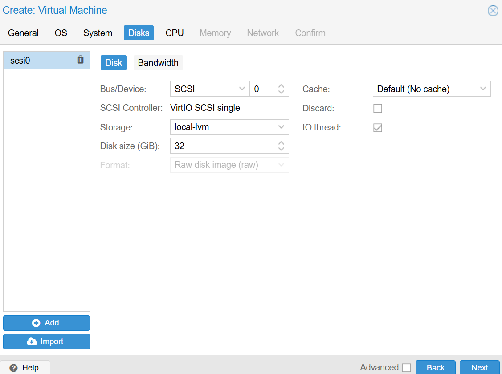

### 💿 **Sélection du système d'exploitation**

Sélection de l'image :

`ubuntu-24.04.5-live-server-amd64.iso`

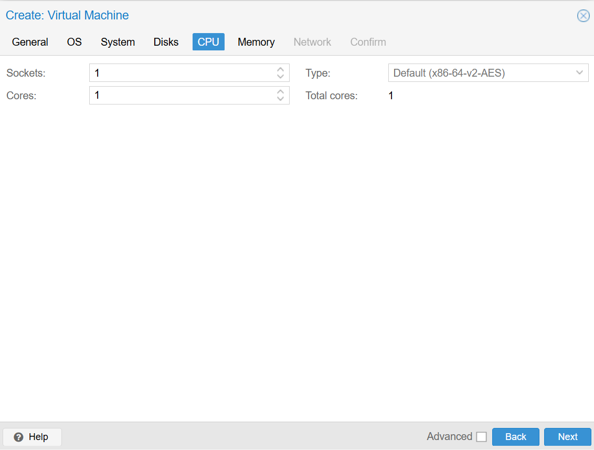

---

## ⚙️ **Étape 5 — Configuration de la VM**

Configuration du système de la machine virtuelle.

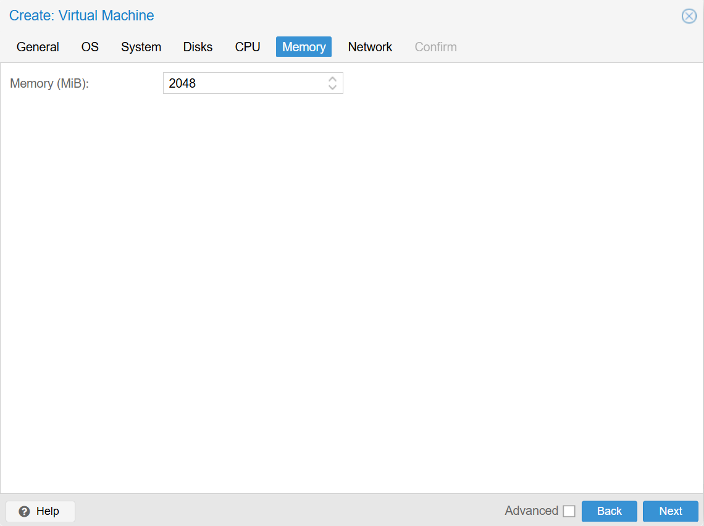

La configuration choisie pour la VM est :

- **Nom :** Ouassim
- **VM ID :** 125
- **OS :** Ubuntu Server 24.04.5 LTS
- **Disque :** 32 GiB
- **Mémoire RAM :** 4 Go
- **Réseau :** VirtIO
- **Bridge :** vmbr0

---

## 🌐 **Étape 6 — Configuration réseau**

La carte réseau virtuelle utilise **VirtIO** et le bridge `vmbr0`.

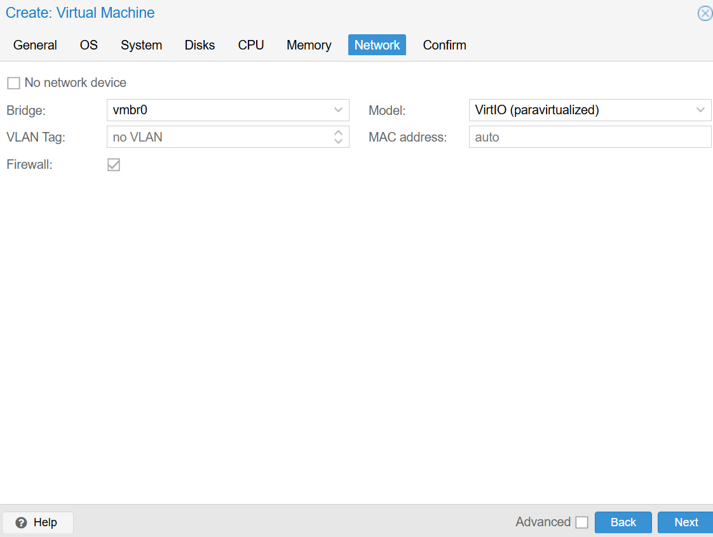

---

## ✅ **Étape 7 — Confirmation de la configuration**

Vérification des paramètres avant la création de la machine virtuelle.

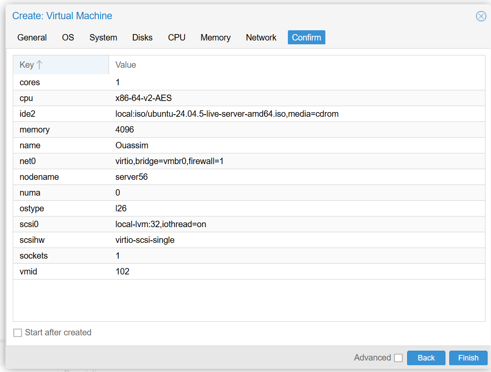

---

## ⚠️ **Étape 8 — Problème rencontré avec le VM ID**

Pendant la création, le VM ID `102` était déjà utilisé par une autre machine virtuelle.

```text
unable to create VM 102
VM 102 already exists on node 'server56'
```

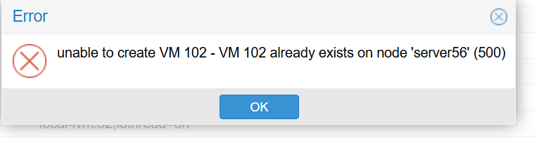

Pour résoudre le problème, un autre identifiant disponible a été utilisé : **VM ID 125**.

---

## 🟢 **Étape 9 — VM créée**

La machine virtuelle **125 (Ouassim)** est maintenant présente sur le serveur Proxmox.

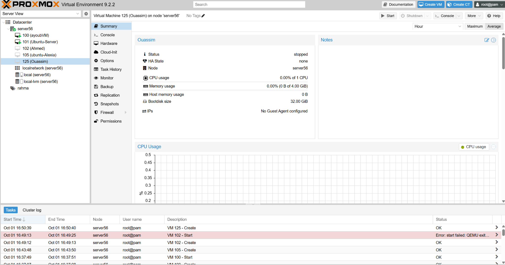

---

## ⚠️ **Étape 10 — Problème de compatibilité CPU**

Au premier démarrage, la VM affiche une erreur liée au processeur :

```text
host doesn't support requested feature: CPUID...ECX.aes
Host doesn't support requested features
TASK ERROR: start failed: QEMU exited with code 1
```

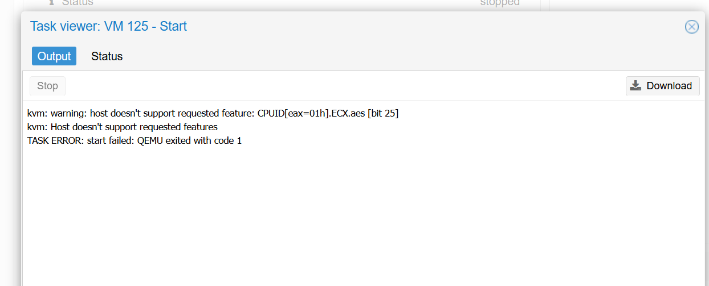

### 🔧 **Solution**

Le type de processeur configuré par défaut n'était pas compatible avec l'ancien processeur du serveur.

Dans :

**VM 125 → Hardware → Processors**

Le type de CPU a été modifié pour utiliser un modèle compatible.

Après cette modification, la VM a pu démarrer correctement. ✅

---

## 🚀 **Étape 11 — Démarrage de la VM**

Ubuntu commence maintenant son démarrage dans la console Proxmox.

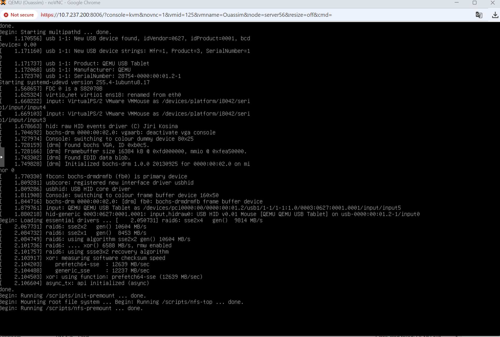

---

## 🐧 **Étape 12 — Ubuntu Server fonctionnel**

Le démarrage est terminé et Ubuntu Server affiche :

```text
Ubuntu 24.04.5 LTS ubuntu-server tty1
```

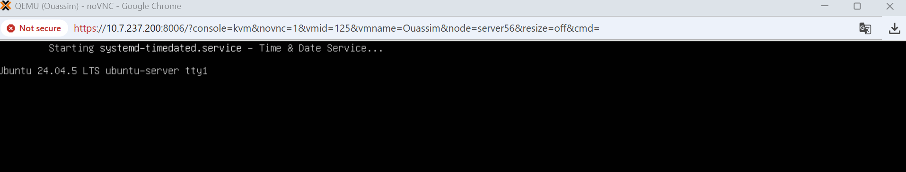

La machine virtuelle Ubuntu Server fonctionne correctement. ✅

---

## 📋 **Configuration finale**

| Composant | Configuration |
|---|---|
| **Serveur** | server56 |
| **Proxmox** | VE 9.2.2 |
| **VM** | Ouassim |
| **VM ID** | 125 |
| **OS** | Ubuntu Server 24.04.5 LTS |
| **RAM** | 4 Go |
| **Disque** | 32 GiB |
| **Réseau** | VirtIO |
| **Bridge** | vmbr0 |

---

## ✅ **Conclusion**

La machine virtuelle **Ubuntu Server 24.04.5 LTS** a été créée et démarrée avec succès sur **Proxmox VE 9.2.2**.

Deux problèmes ont été rencontrés pendant le laboratoire : un **VM ID déjà utilisé** et une **incompatibilité CPU**. Après correction de ces paramètres, la VM a démarré correctement.
