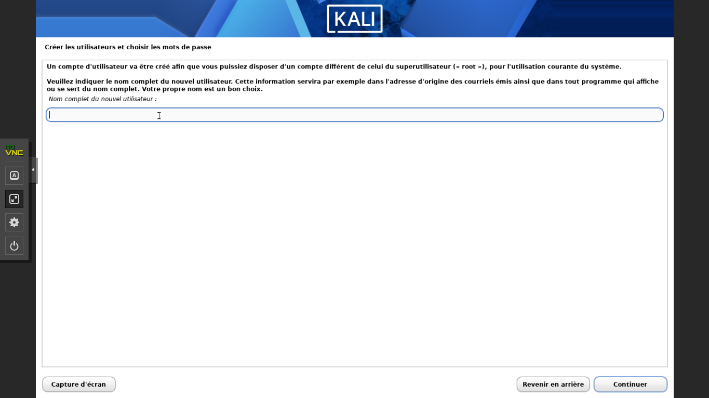
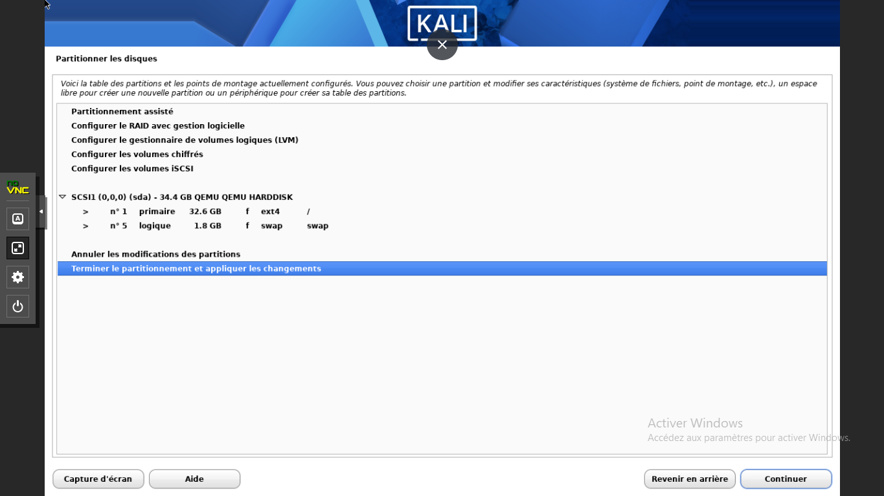
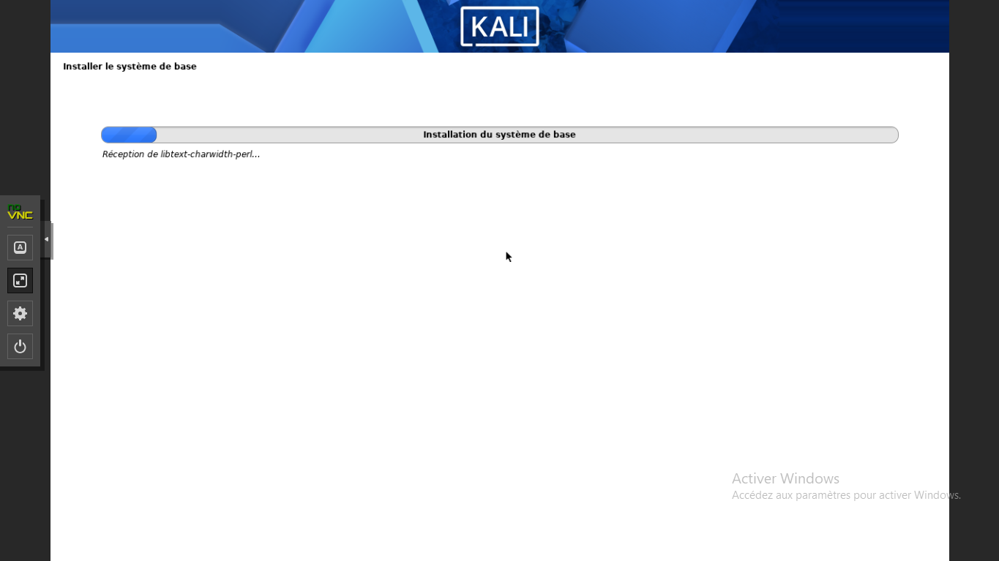
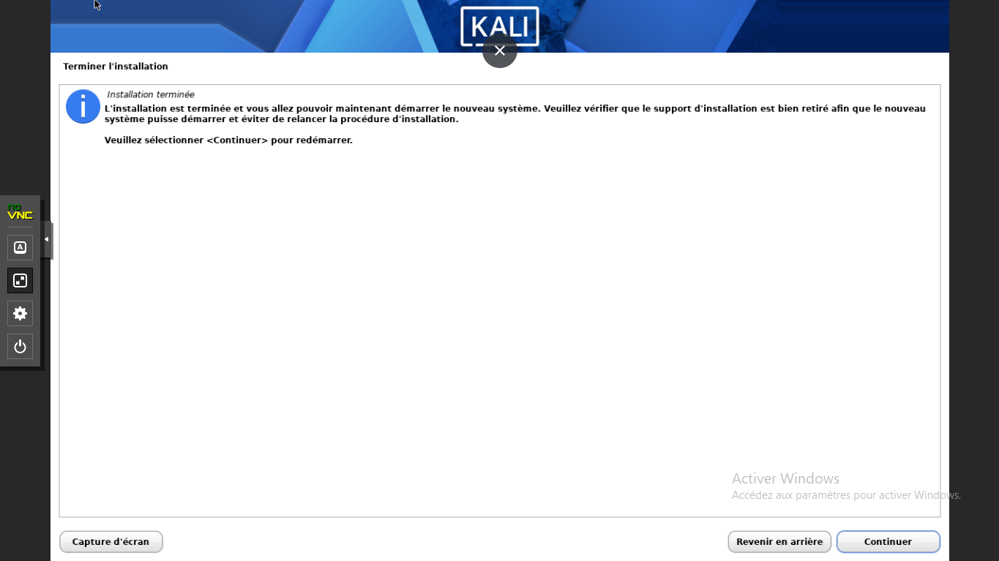
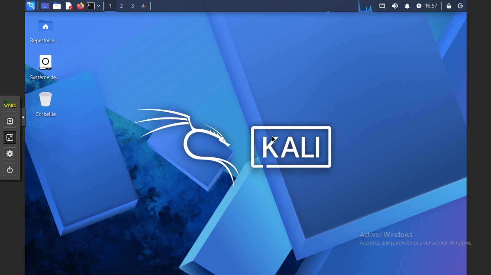
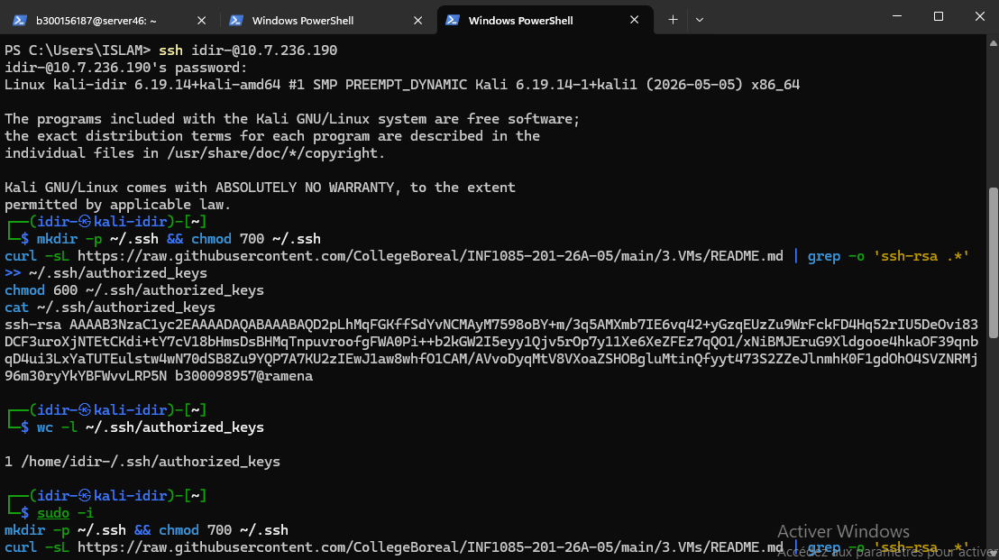

# 3.VMs — Création d'une VM Kali Linux sur Proxmox

**Étudiant :** CHILI Idir Islam — 300156187
**Cours :** INF1085-201-26A-05 — Administration Linux
**Serveur :** `10.7.236.199` (server46, groupe S13)

## 🎯 Objectif

Créer ma propre machine virtuelle sur le serveur Proxmox du groupe, y installer
Kali Linux, la rendre accessible en SSH et y ajouter la clé publique du professeur
pour la correction.

## 🖥️ Caractéristiques de la VM

| Paramètre | Valeur |
| --- | --- |
| VMID | 103 |
| Nom | `kali-idir` |
| OS | Kali Linux 2026.2 (installer-amd64) |
| CPU | 2 cœurs |
| RAM | 4096 Mo |
| Disque | 32 Go sur `local-lvm` (thin) |
| Réseau | `virtio` sur `vmbr0` |
| ISO | `local:iso/kali-linux-2026.2-installer-amd64.iso` |
| Nom d'hôte | `kali-idir` |
| Utilisateur | `idir-` (voir note ci-dessous) |
| Adresse IP | `10.7.236.190/23` (DHCP) |

> ⚠️ **Note :** pendant l'installation, le nom d'utilisateur saisi a été `idir-`
> (avec un tiret final). La connexion SSH se fait donc avec `ssh idir-@10.7.236.190`.

## 📋 Étapes réalisées

### 1. Création d'un utilisateur sudo personnel sur le Proxmox (sur demande du professeur)

Trop de connexions simultanées en `root` provoquaient des déconnexions.
Le professeur a demandé à chaque étudiant de créer son propre utilisateur
avec son ID, avec droits administrateur au lieu de partager le compte `root`.

```bash
# En root, une dernière fois :
adduser b300156187
usermod -aG sudo b300156187
```

Surprise : le paquet `sudo` n'est pas installé par défaut sur Proxmox VE.
Installation nécessaire avant de pouvoir l'utiliser :

```bash
su -
apt update && apt install -y sudo
exit
```

Vérification (`id` montre le groupe `sudo`, `sudo qm list` fonctionne). ✔
(Le détail complet fait l'objet du dossier `4.Root`.)

### 2. Téléchargement de l'ISO Kali Linux 2026.2

Le DNS du serveur ne résolvait pas les noms publics (`/etc/resolv.conf`
ne contenait que le DNS interne). Ajout temporaire de `8.8.8.8`, puis
téléchargement en arrière-plan (4,47 Go) pour survivre à une déconnexion SSH :

```bash
getent hosts cdimage.kali.org   # vérifie que le DNS répond
sudo nohup wget -P /var/lib/vz/template/iso/ \
  https://cdimage.kali.org/kali-2026.2/kali-linux-2026.2-installer-amd64.iso \
  > /tmp/kali-dl.log 2>&1 &
```

Suivi avec `ls -lh /var/lib/vz/template/iso/`.

### 3. Création de la VM 103

L'ID 102 étant déjà pris par une camarade, la VM a été créée avec l'ID **103** :

```bash
sudo qm create 103 --name kali-idir --memory 4096 --cores 2 \
  --net0 virtio,bridge=vmbr0 \
  --scsihw virtio-scsi-pci --scsi0 local-lvm:32 \
  --cdrom local:iso/kali-linux-2026.2-installer-amd64.iso \
  --boot 'order=ide2;scsi0' --ostype l26
sudo qm start 103
```

- `--boot 'order=ide2;scsi0'` : démarrage sur le CD d'installation en premier ;
- `--ostype l26` : noyau Linux 2.6+ (optimise les réglages Proxmox).

### 4. Installation de Kali Linux

Installation via la console noVNC de l'interface web Proxmox
(`https://10.7.236.199:8006`), mode **Graphical install** :

- Langue : Français
- Fuseau horaire : Est (Eastern) — Toronto
- Nom d'hôte : `kali-idir`
- Partitionnement assisté : disque entier, tout dans une seule partition
  (`/` en ext4 + swap)
- Environnement de bureau : Xfce (défaut Kali) + outils recommandés

⚠️ Notes :
- Le menu de démarrage Kali lance la synthèse vocale si aucune touche n'est
  pressée avant la fin du compte à rebours — appuyer rapidement sur Entrée
  sur « Graphical install ».
- Après l'installation, la VM redémarrait sur l'ISO : il a fallu détacher le CD
  et repasser le disque en premier au boot :
  `sudo qm set 103 --boot order=scsi0 --ide2 none,media=cdrom`.

### 5. Configuration réseau et SSH

La VM a obtenu son IP par DHCP : `10.7.236.190/23`.

Installation et activation d'OpenSSH (dans la VM) :

```bash
sudo apt update && sudo apt install -y openssh-server
sudo systemctl enable --now ssh
```

### 6. Clé publique du professeur

Clé récupérée depuis la section *References* de la page `3.VMs` du dépôt du cours,
ajoutée pour l'utilisateur `idir-` **et** pour `root` (sécurité si le professeur
se connecte en root — `PermitRootLogin` par défaut l'autorise par clé) :

```bash
mkdir -p ~/.ssh && chmod 700 ~/.ssh
curl -sL https://raw.githubusercontent.com/CollegeBoreal/INF1085-201-26A-05/main/3.VMs/README.md \
  | grep -o 'ssh-rsa .*' >> ~/.ssh/authorized_keys
chmod 600 ~/.ssh/authorized_keys
```

(Pour root : même opération via `sudo -i`, ou copie du fichier vérifié.)

## ✅ Vérifications

| Test | Résultat |
| --- | --- |
| `sudo qm list` — VM 103 `running` | ✔ |
| Installation Kali terminée, bureau Xfce | ✔ |
| IP de la VM : `10.7.236.190/23` | ✔ |
| `ssh idir-@10.7.236.190` depuis le portable | ✔ |
| Clé du professeur dans `~/.ssh/authorized_keys` (`idir-` et `root`) | ✔ |

## 📸 Captures d'écran

## 📸 Captures d'écran

Les captures sont dans le dossier [`images/`](images/) :








