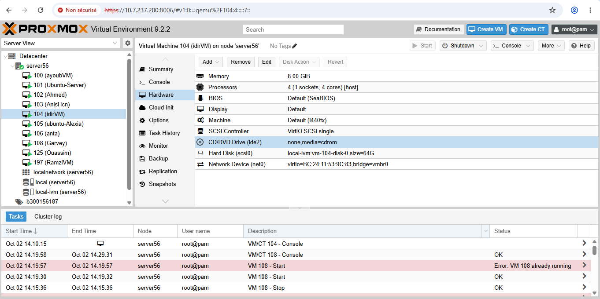
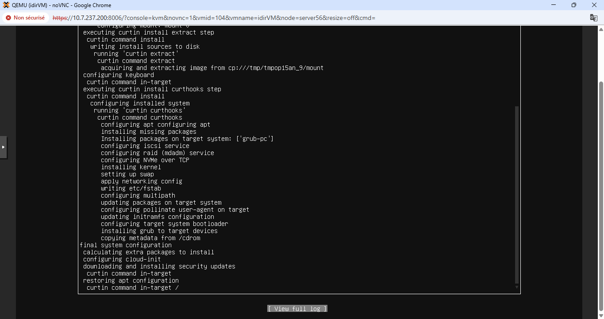
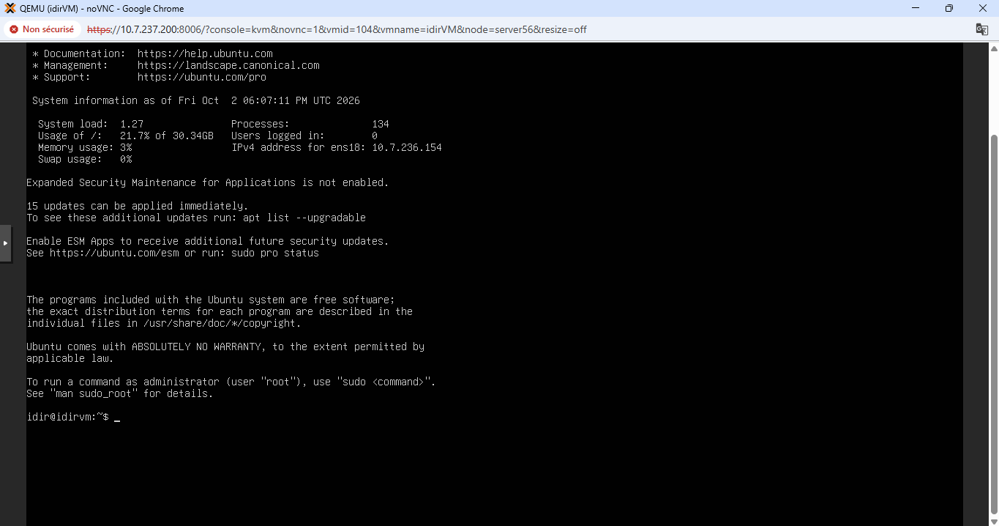

# Création d'une VM sur Proxmox — 300156187

**Étudiant :** Idir Islam Chili (300156187)
**Cours :** INF1085 — Administration Linux
**Date :** 2 octobre 2026
**Serveur :** 10.7.237.200 (server56, Collège Boréal)

## 1. Connexion au serveur

Le serveur n'est joignable que depuis le WiFi du laboratoire : depuis le WiFi
étudiant général (10.7.142.0/23), SSH et ping vers 10.7.237.200 expirent.

```powershell
ssh root@10.7.237.200
```

## 2. Recherche d'un identifiant libre

```bash
pvesh get /cluster/nextid
# 103
```

L'ID 103 étant déjà utilisé par la VM d'un autre étudiant (`ubuntu-linux`),
j'ai listé les VM existantes et choisi le premier ID libre : **104**.

```bash
qm list
# 100 ayoubVM        running
# 101 Ubuntu-Server  running
# 102 Ahmed          running
# 103 ubuntu-linux   running
# 105 ubuntu-Alexia  stopped
# 106 anta           running
# 108 Garvey         running
# 125 Quassim        running
```

## 3. Vérification des ISO disponibles

```bash
pvesm list local --content iso
# local:iso/proxmox-ve_9.2-1.iso
# local:iso/ubuntu-24.04.5-live-server-amd64.iso
# local:iso/ubuntu-24.04.5.1-desktop-amd64.iso
```

Le professeur autorisant n'importe quelle distribution, j'ai d'abord essayé
Kali Linux (`kali-linux-2026.2-installer-amd64.iso`, téléchargée sur le
serveur), mais l'ISO ne démarrait pas (écran noir confirmé par capture
d'écran côté serveur). L'ISO Ubuntu Server 24.04, déjà présente sur le
serveur, démarre correctement : c'est donc elle qui a été retenue.

## 4. Création du pool

```bash
pvesh create /pools --poolid b300156187
```

## 5. Création de la VM

```bash
qm create 104 --name idirVM --pool b300156187 \
  --memory 8192 --cores 4 --cpu host --ostype l26 \
  --scsihw virtio-scsi-single --scsi0 local-lvm:64 \
  --ide2 local:iso/ubuntu-24.04.5-live-server-amd64.iso,media=cdrom \
  --net0 virtio,bridge=vmbr0 --boot order='ide2;scsi0'
```

Caractéristiques :
- **VMID :** 104 — **Nom :** idirVM — **Pool :** b300156187
- **Mémoire :** 8192 Mo — **CPU :** 4 cœurs (host)
- **Disque :** 64 Go (local-lvm, virtio-scsi-single)
- **CD-ROM :** ISO Ubuntu Server 24.04 (ide2)
- **Réseau :** virtio sur vmbr0
- **Ordre de démarrage :** CD-ROM (ide2) puis disque (scsi0)



## 6. Démarrage et installation

```bash
qm start 104
qm status 104
# status: running
```

Installation d'Ubuntu Server 24.04 via la console noVNC
(`https://10.7.237.200:8006`) :
- langue : English — disposition clavier : French (AZERTY)
- disque entier de 64 Go avec LVM (sans chiffrement)
- nom du serveur : `idirVM` — utilisateur : `idir`



À la fin de l'installation, l'installeur demande de retirer le média
d'installation : ISO éjectée dans Proxmox (CD/DVD Drive → « Do not use any
media »), puis ENTER dans la console. Le `[FAILED] Failed unmounting
cdrom.mount` affiché à ce moment est normal dans une VM.

## 7. Premier démarrage

La VM redémarre depuis le disque et affiche l'invite de connexion.
Connexion vérifiée avec l'utilisateur `idir` (le compte `root` est
verrouillé par défaut sur Ubuntu Server). Adresse IP obtenue : 10.7.236.154.



## Résultat

VM **104 (idirVM)** créée dans le pool **b300156187**, démarrée, avec Ubuntu
Server 24.04 installé et fonctionnel (connexion vérifiée avec l'utilisateur
`idir`). Le DNS du serveur partagé n'a pas été modifié et aucune ISO déjà
présente n'a été retéléchargée.
