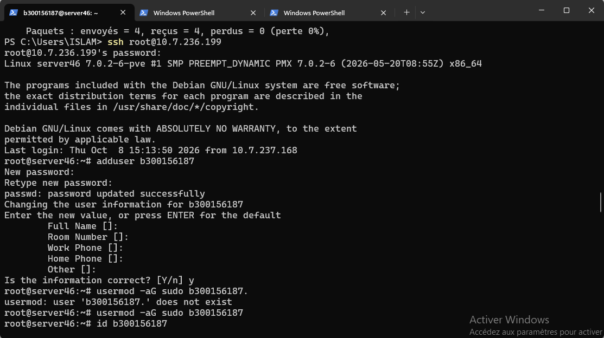
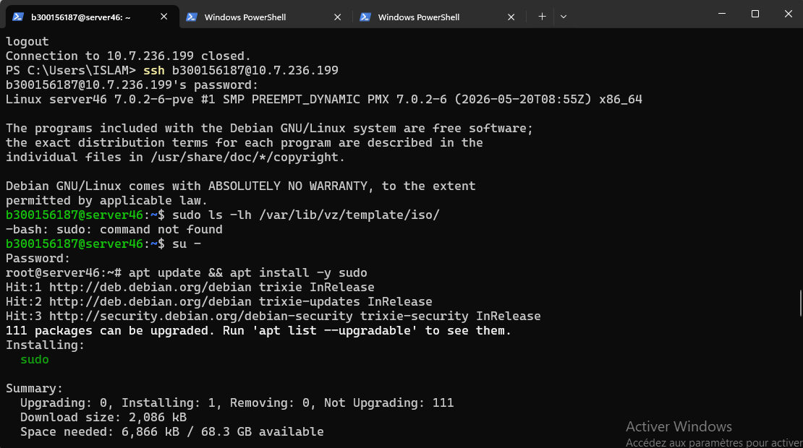

# Créer un utilisateur avec droit Administratif sur Proxmox

**Étudiant :** CHILI Idir Islam — 300156187
**Cours :** INF1085-201-26A-05 — Administration Linux
**Serveur :** `10.7.236.199` (server46, groupe S13)

## 🎯 Objectif

Créer un utilisateur personnel avec droits administratifs sur le serveur Proxmox,
afin de ne plus partager le compte `root` entre tous les étudiants.

## 📖 Contexte

Des déconnexions SSH à répétition ont été constatées sur le serveur.
Après consultation du professeur, la cause identifiée : trop de connexions
simultanées sur le même compte `root`. Consigne : chaque étudiant crée son
propre utilisateur avec son ID, avec droits administrateur (via `sudo`).

## 📋 Étapes réalisées

### 1. Création de l'utilisateur

Connecté en `root` (dernière fois), création de l'utilisateur avec mon ID :

```bash
adduser b300156187
```

L'outil demande un mot de passe (à noter et garder), puis des informations
optionnelles (nom complet, etc.) — ignorées avec Entrée, confirmation avec `Y`.

### 2. Attribution des droits administrateur

Ajout de l'utilisateur au groupe `sudo` :

```bash
usermod -aG sudo b300156187
```

Vérification :

```bash
id b300156187
# uid=1001(b300156187) gid=1001(b300156187) groups=1001(b300156187),27(sudo),100(users)
```

Le groupe `sudo` (27) est bien présent. ✔

### 3. Problème rencontré : `sudo` non installé

Premier test avec le nouveau compte :

```bash
sudo ls -lh /var/lib/vz/template/iso/
# -bash: sudo: command not found
```

Le groupe `sudo` existe sur Proxmox VE, mais **le paquet `sudo` n'est pas
installé par défaut**. Installation nécessaire (en root) :

```bash
su -
apt update && apt install -y sudo
exit
```

### 4. Vérification finale

Reconnecté avec le nouveau compte, test des droits admin :

```bash
ssh b300156187@10.7.236.199
sudo qm list   # demande le mot de passe, puis affiche les VMs ✔
```

L'utilisateur `b300156187` dispose désormais des pleins droits administrateur
via `sudo`, sans partager le compte `root`.

## ✅ Vérifications

| Test | Résultat |
| --- | --- |
| Utilisateur `b300156187` créé | ✔ |
| Membre du groupe `sudo` (`id`) | ✔ |
| Paquet `sudo` installé | ✔ |
| `sudo qm list` fonctionne avec le nouveau compte | ✔ |

## 📸 Captures d'écran

Les captures sont dans le dossier [`images/`](images/) :



